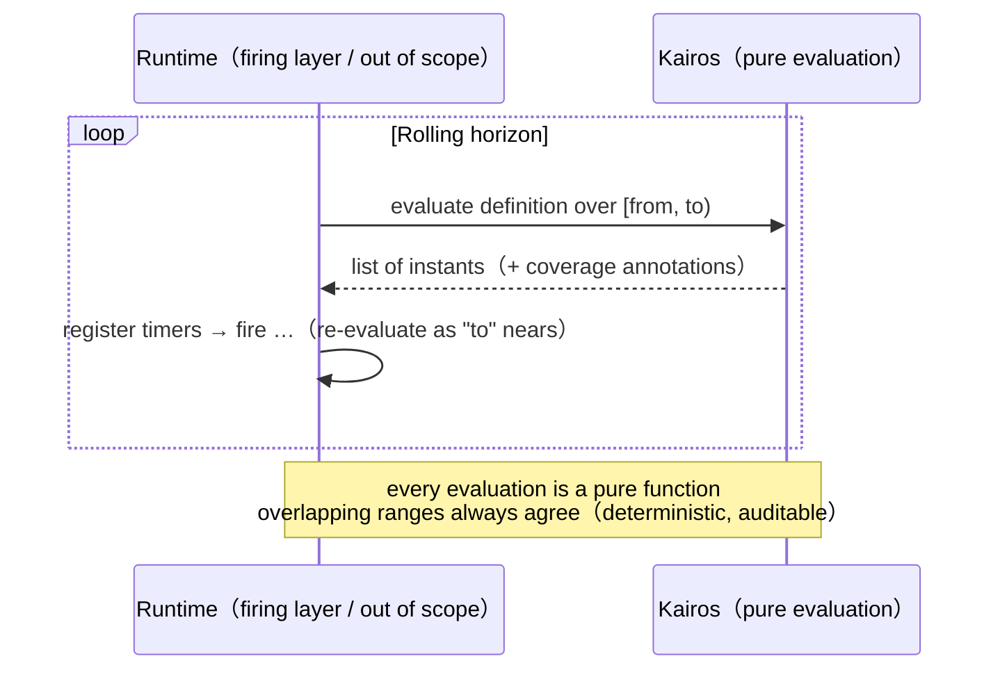

#  Kairos

**English** | [日本語版 README](README.ja.md)（ドキュメントは日本語が正）

**Kairos** is a **schedule definition language** — a small, composable DSL that defines *when things
should happen*. It goes beyond cron-style patterns: schedules like "3 business days before month-end",
"the first business day on or after February 1", or dates derived from the lunisolar calendar are all
first-class expressions.

```text
premise JP { calendar-system: Gregorian; calendar: TSE; tz: "Asia/Tokyo"; wkst: Mon }

@JP
monthEnd |> roll(Preceding, on: bizDay) |> shift(-3, unit: bizDay)   # 3 business days before month-end
```

cron and iCalendar RRULE can express "N *calendar* days before month-end", but no existing schedule
language lets you write "the Nth *business* day" inside an expression. The root limitation is not a
missing feature — **their expressions do not compose**: you cannot take the dates one rule derives and
feed them into the next rule. Kairos is built around this **closure** property (every expression is a
transformation from a time stream to a time stream), so substitute-holiday derivation, fiscal calendars,
the Japanese lunisolar calendar, and the 24 solar terms are all written with the same small operator family.

## Highlights

- **Business-day arithmetic in the language** — `roll(Preceding, on: bizDay)`, `shift(-3, unit: bizDay)`;
  not a "skip / shift" flag bolted onto an external calendar object.
- **Calendars are user-definable** — the Gregorian calendar itself is a transparent standard library
  written in Kairos ([`stdlib/`](stdlib/)); fiscal years, ISO weeks, and the Japanese lunisolar calendar
  (kyūreki) are ordinary definitions, not built-ins.
- **Deriving, not enumerating** — Japan's substitute holidays and "citizens' holidays" are *derived* by
  rule from the statutory holiday table alone; the rokuyō (六曜) cycle is derived from lunar months.
- **Deterministic and auditable** — a definition denotes a set of instants. Missed fires during downtime
  are enumerable; evaluation is reproducible.
- **Staleness is observable** — when calendar data runs out, results carry machine-readable annotations
  (`covering`) instead of silently degrading.
- **Mistake-proofing as static checks** — timezone, granularity, and alignment mismatches, and missing
  declarations (week start, roll convention, calendar) are errors, not silent misfires.

## Comparison with cron, Quartz, and RRULE

✓ = expressible in the language/definition · △ = partial (hacks, add-ons, implementation-specific) ·
✗ = not expressible. "BDC products" = business schedulers with a business-day-calendar object plus
shift flags. Full version with section pointers: [spec §1.2](spec/00-intro.md).

| Capability | cron | Quartz | RRULE | BDC products | Kairos |
|---|---|---|---|---|---|
| Fixed-time recurrence (daily at 9:00) | ✓ | ✓ | ✓ | ✓ | ✓ |
| Nth weekday (2nd Monday) | △ (day/weekday OR trap) | ✓ (`#`) | ✓ (BYDAY + BYSETPOS) | ✓ | ✓ (`nth`) |
| Month-end / N calendar days before it | ✗ (28–31 hack) | ✓ (`L`) | ✓ (BYMONTHDAY=-1) | ✓ | ✓ (`month \|> last \|> shift`) |
| Business days (holiday-aware) | ✗ | △ (exclusion = skip only) | ✗ (static EXDATE) | ✓ | ✓ (calendar entity + derived `bizDay`) |
| Business-day **arithmetic** (Nth business day) | ✗ | ✗ | ✗ | △ (shift flags only) | ✓ (`roll` / `shift(unit: bizDay)`) |
| **Deriving** holidays by rule (substitute holidays) | ✗ | ✗ | ✗ | ✗ (enumeration only) | ✓ (cascade) |
| User-defined calendars (fiscal, ISO week, lunisolar, solar terms) | ✗ | ✗ | △ (RFC 7529, rarely implemented) | ✗ | ✓ (premise layer) |
| Composition / closure (derived dates feed the next rule) | ✗ | ✗ | △ (RDATE/EXDATE only) | ✗ | ✓ (stream → stream) |
| Cross-timezone composition (Tokyo × NY joint business days) | ✗ | ✗ | ✗ | ✗ | ✓ (`rebase` + alignment checks) |
| DST semantics | △ (implementation-defined) | △ | ✓ (wall clock) | △ | ✓ (declared; gaps/overlaps are explicit errors) |
| **Detecting** stale calendar data | ✗ | ✗ | ✗ | ✗ | ✓ (`covering` + out-of-range annotations) |
| Determinism / audit (definition = set of instants) | ✗ (depends on current time) | ✗ | ✓ | △ | ✓ (missed fires enumerable) |
| Static checks against silent mistakes | ✗ | ✗ | ✗ | ✗ | ✓ (alignment, granularity, tz, mandatory declarations) |

What Kairos deliberately does **not** do: firing, retries, and execution management (the host runtime's
job — the language stops at defining the set of instants); feedback on execution state ("every 5 hours
since the last completion" as one infinite stream — instead, computing the next fire *from an injected
instant* is in scope and pure, see [spec §7.7](spec/90-examples.md)); count-based termination (RRULE
`COUNT`); guaranteeing the authenticity of calendar data (provenance `source:` / `asof:` carries the
evidence; the judgment is external); branching on runtime conditions.

## Runtime integration — how a scheduler consumes Kairos

Kairos deliberately stops at defining *the set of instants*. Your scheduler (the "firing layer") owns
timers, retries, and state, and the division of labor is one simple loop — evaluate over a rolling
horizon, register timers, repeat:



- **Determinism** — the same definition, range, and data always yield the same instants; advancing the
  horizon never changes the overlap. Restarts, replays, and audits are safe.
- **Missed fires** — evaluate over the downtime window [down, up) and you get exactly the instants
  that should have fired, as a plain list.
- **Operational signal** — instants beyond the calendar data's coverage carry machine-readable
  annotations ("your holiday data needs updating"), instead of silently degrading.

Feedback schedules ("every 5 hours *since the last completion*") are not a single infinite stream —
that would feed outputs back into the expression. Instead the runtime injects the last completion
time as data (exactly like a holiday table), and Kairos computes the next fire as a pure function of it:

```text
@JP
lastCompleted = [2026-07-09T14:23] covering: ..     # injected by the runtime (with source:/asof:)
lastCompleted |> snapTo(day) |> roll(Following, on: bizDay) |> shift(+3, unit: bizDay)
#=> 2026-07-14   ("3 business days after the last completion")
```

Full explanation with sequence diagrams and runnable doctests (Japanese):
[spec §7.7–7.8](spec/90-examples.md) and [design/40-examples/07](design/40-examples/07-injected-origin.md).

## Quick start (reference implementation)

Runs TypeScript directly with Node.js 24+; zero runtime dependencies.

```bash
cd impl
npm install          # devDependencies only (typescript / vitest)
npm test             # spec examples, real-ephemeris cross-checks, doctests

node src/cli.ts examples/payday.kairos      --from 2026-01-01 --to 2027-01-01
node src/cli.ts examples/jp-holidays.kairos --from 2026-01-01 --to 2027-01-01
node src/cli.ts examples/rokuyo.kairos      --from 2026-01-01 --to 2027-01-01
```

`jp-holidays.kairos` derives Japan's substitute holidays and citizens' holidays from the statutory
holiday table alone. `rokuyo.kairos` derives the rokuyō cycle (大安 and friends) from the lunisolar
calendar, cut by the National Astronomical Observatory of Japan's new-moon data.

## Status and documentation

**Release candidate (RC5, 2026-07-09).** Semantics, the operator family, grammar (EBNF), and lexis are
frozen; naming is final except one placeholder (`shiftBoundary`, to be settled for 1.0). Expressiveness
is validated against 20 well-known schedule families and by a reference implementation (364 tests),
including cross-checks against the official ephemeris of the National Astronomical Observatory of Japan.

| Directory | Contents |
|---|---|
| [`spec/`](spec/) | **Language specification** (reviewable snapshot; start here) |
| [`reference/`](reference/) | **Descriptor reference** — one page per operator; examples are doctested |
| [`stdlib/`](stdlib/) | Standard premises: `Gregorian`, `Fiscal`, `ISOWeek`, `Kyureki` |
| [`impl/`](impl/) | Reference implementation (TypeScript, zero runtime deps; prototype) |
| [`design/`](design/) | Design records: 44 ADRs, domain model, expressiveness studies |

> **Note on language**: the specification and design records are currently written in Japanese. This
> README is the English entry point; the code examples, the EBNF grammar, and the reference
> implementation are language-neutral. If you would like an English version of a particular document,
> please open an issue.

## License

[Apache-2.0](LICENSE) (attribution in [NOTICE](NOTICE)). Contributions are accepted under Apache-2.0 §5
with a [DCO](https://developercertificate.org/) sign-off (`Signed-off-by:` line). The "Kairos" name and
logo are excluded from the license (Apache-2.0 §6).

