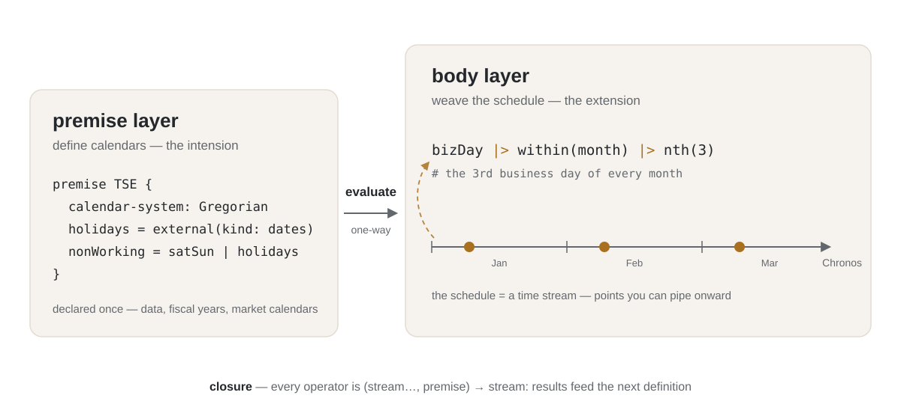
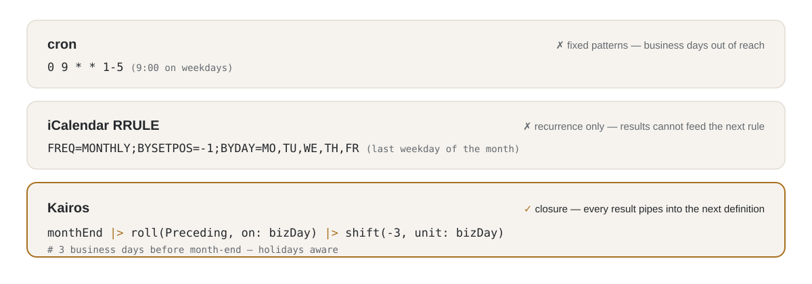
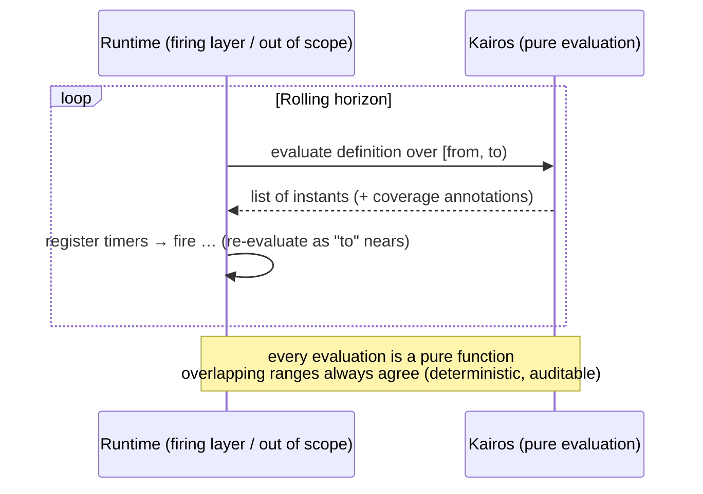

#  Kairos

**English** | [日本語版 README](README.ja.md)（ドキュメントは日本語が正）

> The **Japanese documentation is canonical**; the spec, the descriptor reference, and the stdlib
> guides are **fully mirrored in English** under [`en/`](en/spec/README.md) (every page links its
> counterpart). [`llms.txt`](llms.txt) carries the machine-readable overview. Requests and issues
> in English are welcome — [open an issue](https://github.com/azathothx/kairos-lang/issues).

**Kairos** is a **schedule definition language** — a small, composable DSL that defines *when things
should happen*. It goes beyond cron-style patterns: schedules like "3 business days before month-end",
"the first business day on or after February 1", or dates derived from the lunisolar calendar are all
first-class expressions.

```text
premise US { calendar-system: Gregorian; calendar: NYSE; tz: "America/New_York"; wkst: Sun }

@US
monthEnd |> roll(Preceding, on: bizDay) |> shift(-3, unit: bizDay)   # 3 business days before month-end
```

cron and iCalendar RRULE can express "N *calendar* days before month-end", but no existing schedule
language lets you write "the Nth *business* day" inside an expression. The root limitation is not a
missing feature — **their expressions do not compose**: you cannot take the dates one rule derives and
feed them into the next rule. Kairos is built around this **closure** property (every expression is a
transformation from a time stream to a time stream), so substitute-holiday derivation, fiscal calendars,
the Japanese lunisolar calendar, and the 24 solar terms are all written with the same small operator family.

<p align="center"></p>

## Highlights

- **Business-day arithmetic in the language** — `roll(Preceding, on: bizDay)`, `shift(-3, unit: bizDay)`;
  not a "skip / shift" flag bolted onto an external calendar object.
- **Calendars are user-definable** — the Gregorian calendar itself is a transparent standard library
  written in Kairos ([`stdlib/`](en/stdlib/)); fiscal years, ISO weeks, and the Japanese lunisolar calendar
  (kyūreki) are ordinary definitions, not built-ins.
- **Deriving, not enumerating** — Japan's substitute holidays and "citizens' holidays" are *derived* by
  rule from the statutory holiday table alone; the rokuyō (六曜) cycle is derived from lunar months.
- **Deterministic and auditable** — a definition denotes a set of instants. Missed fires during downtime
  are enumerable; evaluation is reproducible.
- **Staleness is observable** — when calendar data runs out, results carry machine-readable annotations
  (`covering`) instead of silently degrading.
- **Mistake-proofing as static checks** — timezone, granularity, and alignment mismatches, and missing
  declarations (week start, roll convention, calendar) are errors, not silent misfires.

## What an error looks like

Every diagnostic has three parts: `operator: what is wrong（how to fix it. where the rule lives）`. The text
is Japanese (the canonical language); the trailing reference (I3, ADR-38, §3.3) is the spec's own numbering
and can be looked up in the English mirror. Three real ones from the reference CLI 1.0.5:

- `roll は規約が必要（I3）——位置引数で Following/Preceding を書くか前文で roll: を宣言` — "roll: a convention
  is required (I3) — write Following/Preceding as the positional argument, or declare roll: in the premise".
  Fix: `roll(Preceding, on: bizDay)`, or once in the preamble, `@JP roll: Preceding`.
- `strideBy: 幅は正の量（0 幅は前進しない＝無限ループ。1s・1d のような正の幅を書く。ADR-38 判断 12）` — "strideBy:
  the width must be positive (a zero width never advances = an infinite loop; write a positive width such as
  1s or 1d. ADR-38 decision 12)". Fix: `strideBy(1d, from: 2026-01-01)`.
- `stride: n は 1 以上の整数（0 は不可。ADR-38 判断 12）` — "stride: n is an integer of 1 or more (0 is not
  allowed. ADR-38 decision 12)". It does not become a silent empty stream. Fix: `stride(2, from: 2026-01-05)`.

The CLI prints the message and exits with code 1; no result is emitted.

## Comparison with cron, Quartz, and RRULE

✓ = expressible in the language/definition · △ = partial (hacks, add-ons, implementation-specific) ·
✗ = not expressible. "BDC products" = business schedulers with a business-day-calendar object plus
shift flags. Full version with section pointers: [spec §1.2](en/spec/00-intro.md).

<p align="center"></p>

| Capability | cron | Quartz | RRULE | BDC products | Kairos |
|---|---|---|---|---|---|
| Fixed-time recurrence (daily at 9:00) | ✓ | ✓ | ✓ | ✓ | ✓ |
| Nth weekday (2nd Monday) | △ (day/weekday OR trap) | ✓ (`#`) | ✓ (BYDAY + BYSETPOS) | ✓ | ✓ (`nth`) |
| Month-end / N calendar days before it | ✗ (28–31 hack) | ✓ (`L`) | ✓ (BYMONTHDAY=-1) | ✓ | ✓ (<code>month &#124;> last &#124;> shift</code>) |
| Business days (holiday-aware) | ✗ | △ (exclusion = skip only) | ✗ (static EXDATE) | ✓ | ✓ (calendar entity + derived `bizDay`) |
| Business-day **arithmetic** (Nth business day) | ✗ | ✗ | ✗ | △ (shift flags only) | ✓ (`roll` / `shift(unit: bizDay)`) |
| **Deriving** holidays by rule (substitute holidays) | ✗ | ✗ | ✗ | ✗ (enumeration only) | ✓ (cascade) |
| User-defined calendars (fiscal, ISO week, lunisolar, solar terms) | ✗ | ✗ | △ (RFC 7529, rarely implemented) | △ (internal rules only; degrade to expanded lists across the API boundary) | ✓ (premise layer) |
| Composition / closure (derived dates feed the next rule) | ✗ | ✗ | △ (RDATE/EXDATE only) | ✗ | ✓ (stream → stream) |
| Cross-timezone composition (Tokyo × NY joint business days) | ✗ | ✗ | ✗ | ✗ | ✓ (`rebase` + alignment checks) |
| DST semantics | △ (implementation-defined) | △ | ✓ (wall clock) | △ | ✓ (declared; gaps/overlaps are explicit errors) |
| **Detecting** stale calendar data | ✗ | ✗ | ✗ | ✗ | ✓ (`covering` + out-of-coverage annotations) |
| Determinism / audit (definition = set of instants) | ✗ (depends on current time) | ✗ | ✓ | △ | ✓ (missed fires enumerable) |
| Static checks against silent mistakes | ✗ | ✗ | ✗ | ✗ | ✓ (alignment, granularity, tz, mandatory declarations) |

What Kairos deliberately does **not** do: firing, retries, and execution management (the host runtime's
job — the language stops at defining the set of instants); feedback on execution state ("every 5 hours
since the last completion" as one infinite stream — instead, computing the next fire *from an injected
instant* is in scope and pure, see [spec §7.7](en/spec/90-examples.md)); guaranteeing the authenticity
of calendar data (provenance `source:` / `asof:` carries the evidence; the judgment is external);
branching on runtime conditions. (Count-based termination — RRULE `COUNT` — was on this list until
ADR-49: it is now covered by `take(n, from:)`.)

## Runtime integration — how a scheduler consumes Kairos

Kairos deliberately stops at defining *the set of instants*. Your scheduler (the "firing layer") owns
timers, retries, and state, and the division of labor is one simple loop — evaluate over a rolling
horizon, register timers, repeat:


```mermaid
sequenceDiagram
    participant R as Runtime (firing layer / out of scope)
    participant K as Kairos (pure evaluation)
    loop Rolling horizon
        R->>K: evaluate definition over [from, to)
        K-->>R: list of instants (+ coverage annotations)
        R->>R: register timers → fire … (re-evaluate as "to" nears)
    end
    Note over R,K: every evaluation is a pure function<br/>overlapping ranges always agree (deterministic, auditable)
```

- **Determinism** — the same definition, range, and data always yield the same instants; advancing the
  horizon never changes the overlap. Restarts, replays, and audits are safe.
- **Missed fires** — evaluate over the downtime window [down, up) and you get exactly the instants
  that should have fired, as a plain list.
- **Operational signal** — instants beyond the calendar data's coverage carry machine-readable
  annotations ("your holiday data needs updating"), instead of silently degrading.

Feedback schedules ("every 5 hours *since the last completion*") are not a single infinite stream —
that would feed outputs back into the expression. Instead the runtime injects the last completion
time as data (exactly like a holiday table), and Kairos computes the next fire as a pure function of it:

```text
@US
lastCompleted = [2026-07-09T14:23] covering: ..     # injected by the runtime (with source:/asof:)
lastCompleted |> snapTo(day) |> roll(Following, on: bizDay) |> shift(+3, unit: bizDay)
#=> 2026-07-14   ("3 business days after the last completion")
```

Full explanation with sequence diagrams and runnable doctests:
[spec §7.7–7.8](en/spec/90-examples.md); the full worked study is
[design/40-examples/07](design/40-examples/07-injected-origin.md) (Japanese).

## Quick start (reference implementation)

**Try it in your browser first**: the [Playground](https://kairos-lang.org/en/playground/) runs the
reference implementation as-is — no install, nothing leaves your browser.

**Install from npm** (Node.js 20+; zero runtime dependencies):

```bash
npm i -g kairos-lang                             # or without installing: npx kairos-lang --version
kairos list impl/examples/payday.kairos --from 2026-01-01 --to 2027-01-01
kairos next -n 3 --json impl/examples/payday.kairos   # next 3 firings from today, machine-readable
```

(`impl/examples/` lives in this repository; the npm package ships the CLI and the stdlib. The block below runs
the TypeScript source directly, for development.)

Runs TypeScript directly with Node.js 24+; zero runtime dependencies.

```bash
cd impl
npm install          # devDependencies only (typescript / vitest)
npm test             # spec examples, real-ephemeris cross-checks, doctests

node src/cli.ts list examples/payday.kairos      --from 2026-01-01 --to 2027-01-01
node src/cli.ts list examples/jp-holidays.kairos --from 2026-01-01 --to 2027-01-01
node src/cli.ts list examples/rokuyo.kairos      --from 2026-01-01 --to 2027-01-01
node src/cli.ts next -n 3 examples/payday.kairos   # next 3 firings from today (--json for machines)
```

`--lang en` switches the human-readable framing (headings, coverage summary, usage) to English;
evaluator messages stay in Japanese — the implementation's canonical output — and `--json` is
language-neutral.

`jp-holidays.kairos` derives Japan's substitute holidays and citizens' holidays from the statutory
holiday table alone. `rokuyo.kairos` derives the rokuyō cycle (大安 and friends) from the lunisolar
calendar, cut by the National Astronomical Observatory of Japan's new-moon data.

## Limits (what it does not do)

- **Calendar model**: the proleptic Gregorian calendar as an idealisation (the leap-year rule is applied to
  every year; the 1582 reform is not modelled). Other calendars are built on top of it in the premise layer
  (spec §3.6).
- **No leap seconds**: the base axis (chronos) is uniform; `23:59:60` is a lexical error (spec §5, ADR-33).
- **Years have four digits** (0000–9999); `10000-01-01` is a lexical error.
- **DST**: civil widths (`1d`) keep wall-clock time, so a civil day may be 23–25 hours; a time literal that
  falls into a DST gap or overlap is an error, not a guess (spec §3.6, §5; ADR-33, ADR-51). A civil width is
  a whole number of days (`1.5d` is an error; write `36h`).
- **Reference implementation only, not the language**: the evaluation range starts at 1970-01-01 (an earlier
  `--from` is an explicit error); points are materialised up to `to` + 400 days and a `horizon-clip` warning
  marks that edge; a point that a stage moves out of `[from, to)` is not in the output and gets a
  `window-clip` warning; there is no cap on the number of points — memory grows with the output, and the
  caller chooses the range (a service front end should bound the range; the language does not); the time
  resolution is 1 ms (a finer width or seconds fraction is a lexical error, not a silent rounding).
- **Out of scope**: firing, retries, logging and job execution belong to the host (spec §7.8); `Modified`
  roll conventions and the general composition of `everyInstant` are unimplemented (impl/README).

## Status and documentation

**Version 1.0 (declared 2026-09-14; addenda through no. 22, 2026-09-29).** Semantics, the operator family, grammar (EBNF), and lexis are
frozen; naming is final for every word (the last placeholder `shiftBoundary` was settled as `rephase` on 2026-07-26). Expressiveness
is validated against 20 well-known schedule families and by a reference implementation (730 tests),
including cross-checks against the official ephemeris of the National Astronomical Observatory of Japan.

| Directory | Contents |
|---|---|
| [`spec/`](en/spec/) | **Language specification** (reviewable snapshot; start here — [日本語](spec/)) |
| [`recipes/`](en/recipes/) | **Recipes** — the schedules cron/Quartz/RRULE can't express, one page per requirement with Playground links ([日本語](recipes/)) |
| [`reference/`](en/reference/) | **Descriptor reference** — one page per operator; examples are doctested ([日本語](reference/)) |
| [`stdlib/`](en/stdlib/) | Standard premises: `Gregorian`, `Fiscal`, `ISOWeek` ([日本語](stdlib/) — includes the Japanese-only `Kyureki`) |
| [`impl/`](impl/) | Reference implementation (TypeScript, zero runtime deps; prototype — Japanese) |
| [`design/`](design/) | Design records: 53 ADRs, domain model, expressiveness studies incl. the ["impossible schedules" catalog](en/design/40-examples/11-impossible-schedules.md) (Japanese; catalog mirrored in English) |

Study materials for the Kairos language exam — graded textbooks (reading, writing, operational
semantics) and sample questions, every example executed against the reference implementation — live at
[exam.kairos-lang.org](https://exam.kairos-lang.org/) (Japanese).

## License

[Apache-2.0](LICENSE) (attribution in [NOTICE](NOTICE)). Contributions are accepted under Apache-2.0 §5
with a [DCO](https://developercertificate.org/) sign-off (`Signed-off-by:` line). The "Kairos" name and
logo ([assets/logo/](assets/logo/README.md)) are excluded from the license (Apache-2.0 §6).

