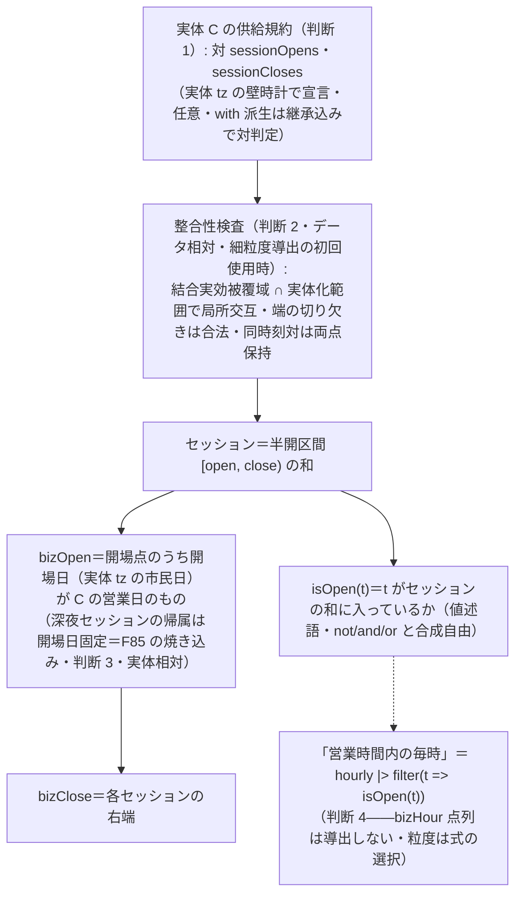

# ADR-41: 営業時間の供給規約と標準導出——opens/closes と isOpen

**判断**: カレンダー実体（ADR-35）の細粒度層（営業時間・半日休＝F67）を次のとおり確定する
（draft §1.24 の候補設計＝4 視点検証・指摘 39 件反映済み。設計者裁定 3 件〈2026-07-08/09〉:
F79＝標準導出を規定・同時刻対＝両点保持・isOpen＝実体の文化で解決）。

1. **供給規約＝実体の予約公開語の対 `opens`・`closes`（いずれも仮称・F51）**。カレンダー実体は
   `nonWorking` に加えて開場列・閉場列（時間ストリーム型・引数なしの束縛）を宣言できる。宣言は
   **対**（片方だけは静的エラー。`with` 派生では継承込みで判定——opens だけ上書きし closes を
   継承する派生は合法）・宣言自体は**任意**（無ければ細粒度導出が使えないだけ）。点は**実体 tz の
   市民座標の事実**（壁時計——F76 裁定「文化は premise 層の決まり」の執行形。規則は時刻付き
   anchor の市民グリッド〈ADR-31 改訂 2〉か strideBy の市民時幅・例外は時刻付きテーブルの合成。
   ADR-33 判断 10 の内側固定はそのまま効く）。深夜セッション（開 22:00・閉 翌 03:00）は合法——
   「同一市民日」は要件にしない。**24 時間営業はこの器の外**（作法: 終日営業は日粒度の層
   〈bizDay〉が既に表しており、opens/closes を宣言しない）。

   ```text
   premise TSE {
     calendar-system: Gregorian
     tz:     "Asia/Tokyo"
     source: "jpx.co.jp/trading-calendar"
     satSun     = everyDay |> filter(d => weekday(d) == Sat or weekday(d) == Sun)
     holidays   = [2026-01-01] covering: 2026..2026
     nonWorking = satSun | holidays
     # 営業時間 9:00–11:30・12:30–15:00（二部制）。半日休（大納会級）は前場のみ
     am9   = chronos grid 1d anchor: 2026-01-01T09:00
     pm30  = chronos grid 1d anchor: 2026-01-01T12:30
     am30c = chronos grid 1d anchor: 2026-01-01T11:30
     pm3c  = chronos grid 1d anchor: 2026-01-01T15:00
     halfDays = [2026-12-30] covering: 2026..2026
     opens  = (am9 |> first) | (pm30 |> first |> filter(t => not coincides(halfDays, day, t)))
     closes = (am30c |> first) | (pm3c |> first |> filter(t => not coincides(halfDays, day, t)))
   }
   ```

2. **セッションの意味論は半開区間の和**。opens/closes は半開区間 `[open_i, close_i)` の列
   （セッション）を定める。**整合性検査**（F84 の封じ）: 定義域は**結合実効被覆域**
   （opens/closes の全構成枝の被覆の積）**∩ 実体化範囲**——註釈区間は未知であって違反ではない。
   条件は**局所交互**（定義域内で各マーカーの直前のマーカーは逆種）・定義域の端の孤立 close
   （頭）・孤立 open（尾）は**切り欠きとして合法**（深夜セッションが範囲頭で close 始まりに
   見えるのは正常）。エラーの層は**データ相対**（ADR-33 判断 9 の層——マーカー位置はデータと
   tz 評価に依存し「静的」ではない）。検査の走る点は**細粒度導出の初回使用時**（bizDay しか
   使わない利用では走らず、opens/closes の実体化コストも払わない）。
   **同時刻の open/close は両点とも存在する**（裁定）——順序は交互性の要件から一意に定まり
   （文脈により close→open＝連続営業 か open→close＝幅 0 セッション）、isOpen（区間の所属）は
   どちらの読みでも同じ答え。同時イベントの**発火**の扱いは処理系（発報層）の領分（スコープ外）。
   検査・順序付けは対のストリーム上で規定する（和 `opens | closes` では同時刻対が観測できない）。

3. **標準導出＝`bizOpen`・`bizClose`（導出ストリーム）と `isOpen(t)`（導出値述語。いずれも
   仮称）**。在圏 `calendar:` の実体 C が opens/closes を宣言しているとき言語が一律に規定
   （`calendar:` 在圏で予約名——手動束縛は静的エラー・bizDay と同格。未宣言の実体で導出語は
   静的エラー）:

   ```text
   bizOpen   =  C.opens のうち「開場点の属する C-tz の市民日が C の営業日」の点
                （C の営業日 ＝ C.everyDay \ C.nonWorking を C の内側で読む）
   bizClose  =  各 bizOpen セッションの閉場点（区間の和の右端）
   isOpen(t) =  t が bizOpen セッションの区間の和に入っているか（半開・Bool）
   ```

   - **導出は実体相対**（裁定・bizDay と非対称）: セッションは**実体の状態の chronos 事実**で
     あり、判定材料（どの日が休みか・時刻をどの tz で読むか）は**実体の文化**で解決する。
     東証が開いているかは東証の文化だけで決まる——読み手の premise の tz に依存せず、クロス tz の
     利用が自然に立つ（別文化圏の事実の利用は常に実体の名指し〈`calendar:`・修飾ピン〉を経由
     する——名指しがある限り黙って混ざらない）。日粒度の `bizDay`（利用側の日々から引く軸＝
     ADR-35 判断 3）との非対称は**役割の違い**として glossary に明記する。
   - **セッションの営業日性は開場日（実体 tz）で読む**——深夜セッションの尾部は開場日が営業日
     なら営業中（F85 の修理形を導出に焼き込む）。祝日の開場 tick は bizOpen から落ち、その
     セッションは丸ごと isOpen 偽。**帰属は開場日固定**——CME Globex 級の「トレード日帰属」は
     実体側の供給合成で書けるため、帰属ノブは需要が立つまで導入しない（F90・宿題）。
   - **覆域は証人規則の三分岐**（ADR-38 判断 4 と同じ骨格）: 真＝判定が非註釈のマーカー・営業日
     データだけで立つ／範囲外＝判定が opens・closes・nonWorking いずれかの註釈区間に依存する
     （マーカー覆域だけでなく bizOpen の依存註釈も源——過小近似は不可＝ADR-37）／偽＝覆域完全の
     側。混合供給（規則枝∪データ濾過枝）の実効被覆域は註釈の和で**例外テーブルの covering に
     頭打ち**（保守側。被覆サマリの残走路が運用の監視点・実体データの年次更新は holidays と同じ
     運用）。
   - **isOpen は値述語**——`not`・`and`/`or`・他の射影と自由に合成（「営業時間内の毎時」＝
     `hourly |> filter(t => isOpen(t))`。値関数は第一級値ではないためポイントフリーは不可・
     coincides と同じ）。

4. **`bizHour` 級の点列は導出しない**。「営業中の毎正時」の 1h は式の側の粒度選択であって
   カレンダーの属性ではない（30 分毎も同格）。`hourly |> filter(t => isOpen(t))` の合成で書く。
   セッション内序数が要るときは帯（segmentBy）を手元で張って `ordinalIn`——gappy な窓列
   （営業側だけの窓列）は窓の型の新設になるため導出しない。

5. **統治の細目**: opens/closes を上書きする派生は `source:` も上書き（宣言必須寄り＝ADR-35
   判断 5 の延長——改変した営業時間が公式出所を名乗らない）。整合性検査は派生実体でもその
   初回使用時に走る（継承 closes と上書き opens の不整合はここで捕まる）。循環検査（ADR-35
   判断 8）は導出鎖（isOpen → bizOpen → C.nonWorking）越しの自己・相互参照まで延長。
   `C.opens` の修飾ピンによる生読みは合法（実体 tz の事実の直接利用——結合すれば既存の整列・
   tz 検査網に掛かる）。

図解（2026-07-13 追補・判断 1〜4 の流れ——判断内容の変更なし。語は改訂 2 後の正式名で表記）:



**背景**: F67（F52 裁定「時刻も射程内」の残り半分）。綻び出し（40-examples/06）で読む側は確定
語彙のみで全部書けると実証し（新語彙は表現力の必然としては不要）、設計者裁定（2026-07-08）で
「作法に留めず標準導出を規定する」方向を確定。候補設計（draft §1.24）の 4 視点検証で当初案の
構造欠陥 4 件（F86〜F89）を修正し、残る裁定 3 件（2026-07-09）で確定した。設計原理は F76 裁定——
「DST で時刻をずらすかそのままかは文化＝premise 層の決まりであって、本体層が式の書き分けで背負う
問題ではない」——であり、開閉時刻は市民座標で宣言し DST 挙動は premise の tz 規則から従う。

**却下した案**:

- **供給を帯（窓列）で宣言**——窓は生成の産物で持ち込み口が無い（テーブルは点列・ADR-26）。
  点列（開閉マーカー）が原始で、帯は導出。
- **`opens:`/`closes:` を前文メンバー（文脈値）に**——ストリームをメンバーに持つのは層違い
  （ADR-35 却下案 4 と同型）。可変規則（二部制・半日休の合成）が書けない。
- **時刻リテラルのメンバー（`opens: 09:00`）**——新字句（単独時刻リテラル＝F66 隣接）が要る上に
  固定時刻しか書けない。糖衣（`dailyAt(09:00)` 級・F77）が将来この字面を回復する余地は残す。
- **`bizHour` 点列の言語規定**——判断 4 のとおり（粒度は式の選択）。
- **営業側だけの gappy 窓列（`bizSession` 窓語）の予約**——隙間のある窓列は窓の型の新設。点列＋
  述語で足りる（将来の拡張候補として記録のみ）。
- **isOpen を作法に留める**——裁定で却下（F79）。
- **利用側相対の bizOpen（当初案）**——読み手の tz が実体と違うだけで導出が全滅し「いま開いて
  いるか」という chronos 的に定まる問いを塞ぐ（F89）。実体相対へ修正（判断 3）。
- **同時刻対の禁止（当初案）・相殺（検証中間案）**——禁止は接するセッションが書けず DST 縮退で
  実体が止まる（F86）。相殺は点を消す。裁定＝両点保持・順序は交互性・発火は処理系（判断 2）。

**帰結**:

- spec §3.9（カレンダー実体）に細粒度層の節を追補（供給規約・標準導出・整合性検査）。glossary に
  `opens`/`closes`/`bizOpen`/`bizClose`/`isOpen`（仮称印つき）と「実体相対／利用側相対」の対比を
  追加。EBNF は変更なし（供給は既存の premise 束縛・導出は既存の名前解決）。
- ADR-31 改訂 2（F81 時刻付き anchor の窓境界・F83 shift の経過保存＝本 ADR の宣言側と対になる
  算術側の確定）・ADR-38 改訂（正準例の更新＝F76 帰結）・ADR-35 改訂（予約公開語の対の追加・
  派生統治・循環の延長）を同時に確定。
- reference: `isOpen.md`（導出一族）の新設・`nonWorking.md` の細粒度節・`coincides.md` の正準例
  差し替え・`shift.md` の但し書き・`grid.md` の「書くのは暦法定義者だけ」の字面補正（実体の
  時刻 anchor グリッドが第二の正当な書き手——06 §6.1/F79 の「暦法層混入の強制」論証は失効）。
- リファレンス実装: 対宣言・整合性検査（結合実効被覆域∩実体化範囲・局所交互・端切り欠き・
  同時刻対の文脈順序）・実体相対の導出 3 語（defCache は実体キー・証人三分岐）・F87 の修正
  （anchor の日内オフセットをラベル読みへ）・F83 (a) を固定する回帰テスト。
- 命名はすべて仮称（F51 の一括確定に合流。opens/closes は一般英単語で衝突面が広い——確定時に
  要注意。比較候補: `openings`/`closings`・`sessionOpens`／`openTick`・`sessionStart`／
  `openAt`・`withinHours`・`trading`）。
- 残る宿題: F90（帰属ノブ・需要待ち）・F91（束縛右辺の複数行継続・字句）・F77（帯・dailyAt 級の
  糖衣——頻出確認後）・F78（壁時計の時刻値射影・保留寄り）。

## 改訂（2026-07-09・純命名の確定＝F51）

- 供給の対の正式名を **`sessionOpens`・`sessionCloses`** に確定（旧仮称 `opens`/`closes`——
  一般英単語で偶然の同名束縛との衝突面が広い懸念〈帰結の比較候補に記録済み〉を設計者裁定で解消。
  セッション用語〈本 ADR 判断 1〉と揃う最も明示的な形）。標準導出の三語 **`bizOpen`・`bizClose`・
  `isOpen`** はそのまま正式名に確定。本文の `opens`/`closes` は当時の記録として不変・現行の字面は
  spec §3.9.1／§5.4 が正本。
