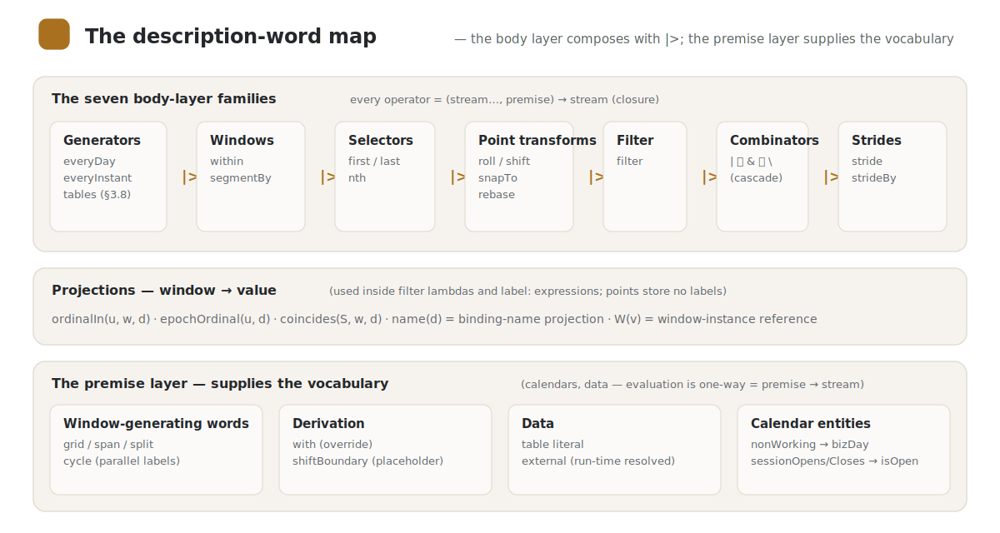

#  Description-Word Reference

> Translated from the canonical Japanese page [reference/README.md](../../reference/README.md).
> The `source_sha` above records the source revision; a consistency check flags this page when the
> Japanese original changes.

Explains Kairos's description words (operators, window-generating words, literals), one word per
file. The norm is the language specification [`../spec/`](../spec/) (this book is the explanatory
layer — the same division of roles by which `stdlib/` carries Gregorian). The index of terms is
[`../spec/50-glossary.md`](../spec/50-glossary.md).

## Conventions for runnable examples (doctest)

Of the code examples in this book, those in **` ```kairos ` fences** are **execution-verified**
against the reference implementation ([`../../impl/`](../../impl/)) (`impl/test/doctest.test.ts`).
The same conventions extend to the explanatory pages of [`../stdlib/`](../stdlib/).

- The `# eval: FROM..TO` line in a block is the evaluation range (`[FROM, TO)`). The optional
  postfix `tz: Zone` (e.g. `# eval: 2026-03-06..2026-03-10 tz: America/New_York`) overrides the
  execution/display tz (default Asia/Tokyo) — so that multi-TZ examples can write their expected
  values in the premise's wall clock. Make `tz:` match the example premise's tz (do not attach it
  to `@JP` = Asia/Tokyo blocks; a mismatch is not checked — only the endpoints of the evaluation
  range and the display move to the execution tz's side).
- `#=>` lines are the expected values (the result of the last body expression;
  whitespace-separated, multiple lines allowed). **Absence of the line is a claim of "zero points
  (an empty sequence)"** (symmetric with the `#~>` default — empty-table (ADR-45)-class examples
  assert emptiness by writing no `#=>`. A bare `#=>` line is not read as an expectation, so it is
  not written). Both are Kairos line comments, so the source stays valid as-is. Points at exact
  midnight print as the date only (the same notation as day-granularity points). Sub-second
  fractions are truncated in display (a point at `…T00:39:35.244` prints as `…T00:39:35`; point
  identity is kept at ms precision — a rounding of display, not of value).
- `#~>` lines are the **expected annotations and warnings** (the last body expression's interval
  annotations = the same canonical one-line form as the CLI's `⚠` lines,
  `範囲外 FROM..TO（源 covering …[, asof …]）`; warnings are prefixed `警告: `. Matched in order of
  appearance). Translator's note: annotation expectation lines (`#~>`) reproduce the reference
  implementation's canonical one-line output, which is currently Japanese; they are kept verbatim
  in this English mirror.
- A `# resolve: bindingName = dates date… covering: … asof: …` line is the resolver fixture for
  [`external`](external.md) (the data is written inside the document, so verification is
  self-contained. The first stage supports the dates wire only).
  **Absence of the lines is a claim of "zero annotations, zero warnings"** — the degeneration of
  out-of-coverage provenance (ADR-37's "degenerates but is observable") is explicit in runnable
  examples too and never passes silently (sealing the blind spot where, even when horizon demotion
  leaves a year-typo-class mistake at a mere warning, a doctest matching only date sequences would
  let it slide). The coverage summary is a permanently displayed monitoring surface and is
  therefore not matched.
- Blocks that use `@JP` get the standard premises automatically prepended: the calendar entity
  `premise TSE { …; nonWorking = satSun | holidays2026 }` (the actual holidays of 2026 = 18 days,
  including the substitute holiday 5/6 and the citizens' holiday 9/22) and
  `premise JP { calendar-system: Gregorian; calendar: TSE; tz: "Asia/Tokyo"; wkst: Mon }`, plus the
  bindings `holidays2026` and `satSun`. `bizDay` is the **standard derivation** from
  `calendar: TSE` (ADR-35 — the doctest suite as a whole doubles as execution verification of
  entity-mediated derivation).
- ` ```text ` fences are explanatory (not executed).

## Index

<p align="center"></p>

| Category | Word | One line |
|---|---|---|
| Generator | [`everyDay`](everyDay.md) | streams every day of the in-scope calendar system |
| Generator | [`everyInstant`](everyInstant.md) | every point of the continuous base (used with strideBy) |
| Window | [`within`](within.md) | partition-type window (bundle by window name) |
| Window | [`segmentBy`](segmentBy.md) | interval-sequence-type window (cut at markers) |
| Selector | [`first`](first.md) / [`nth`](nth.md) / [`last`](last.md) | the Nth, first, and last within a window |
| Point transform | [`roll`](roll.md) | nudge invalid points to valid ones |
| Point transform | [`shift`](shift.md) | move by n units |
| Point transform | [`snapTo`](snapTo.md) | map to the first point of the containing window (floor) |
| Point transform | [`rebase`](rebase.md) | date-label-preserving re-anchoring (cross-tz same date) |
| Filter | [`filter`](filter.md) | thin by predicate (premise predicate / value-expression predicate) |
| Stride | [`stride`](stride.md) | "every n" points of the input (boundary-ignoring, continuous) |
| Stride | [`strideBy`](strideBy.md) | step by width, "every w" |
| Combinator | [`\|` `&` `\`](combinators.md) | union, intersection, difference, and the cascade |
| Projection | [`ordinalIn`](ordinalIn.md) | the ordinal of the unit window within the frame window (1-based) |
| Projection | [`epochOrdinal`](epochOrdinal.md) | running ordinal from the epoch (0-based) |
| Projection | [`coincides`](coincides.md) | window-membership predicate (is a point of S in d's window) |
| Window-generating word | [`grid`](grid.md) | uniform partition of the continuous axis (the calendar's atoms) |
| Window-generating word | [`span`](span.md) | variable aggregation of unit sequences (bottom-up) |
| Window-generating word | [`split`](split.md) | variable division of a parent window (dependent windows) |
| Window-generating word | [`cycle`](cycle.md) | parallel repeating labels (labels, not windows) |
| Derivation | [`with`](with.md) | override an existing premise's public words |
| Derivation | [`shiftBoundary`](shiftBoundary.md) (placeholder) | sugar shifting window cut points by a unit |
| Literal | [table literal](table-literal.md) | stream constant of an instant sequence (covering:/labels:) |
| Supply | [`external`](external.md) | external supply declaration (a table literal resolved at run time. ADR-46) |
| Calendar entity | [`nonWorking`](nonWorking.md) | the entity's reserved public word and the `bizDay` standard derivation (ADR-35) |
| Calendar entity | [`isOpen`](isOpen.md) | the business-hours supply convention `sessionOpens`/`sessionCloses` and the standard derivations `bizOpen`/`bizClose`/`isOpen` (ADR-41) |
