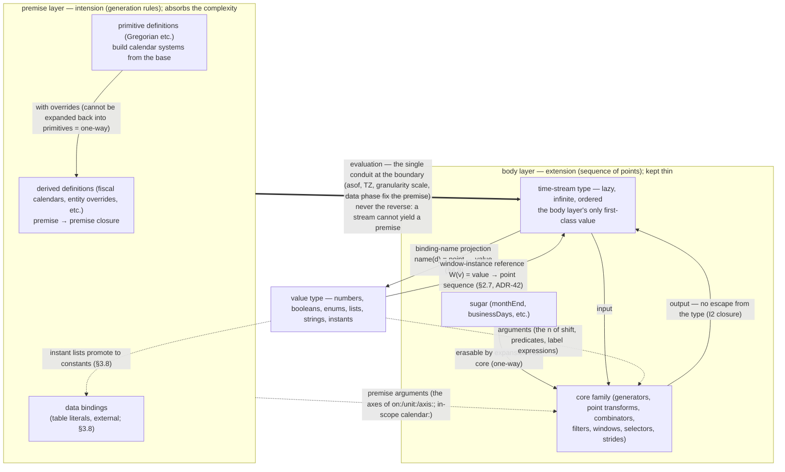

# Kairos Language Specification — 2. Types and Layers

> Translated from the canonical Japanese chapter [spec/10-types.md](../../spec/10-types.md).
> The `source_sha` above records the source revision; a consistency check flags this page when the
> Japanese original changes.

## 2.1 The two-layer structure

Kairos consists of two layers (corresponding to SQL's DDL/DML).

- **Premise layer** — builds calendar systems and calendars. May be multi-line and declarative. The
  layer that defines what a "month" is and what a "business day" is.
- **Body layer** — weaves schedules. One line, pipe-like, wherever possible. The layer that derives
  firing instants using the vocabulary already defined.

Both layers share the same stream vocabulary, but their types are distinct. The premise layer
absorbs the complexity; the body layer stays thin.

## 2.2 The three types

### The time-stream type (the body layer's first-class value)

A lazy, infinite, ordered sequence of points on the base Chronos. Equal definitions are equivalent.
This is the **extension** (the generated sequence of points), and the body layer's only first-class
value. Within the body layer the type is kept to this single one.

### The premise type (intension — generation rules)

The generation rules themselves — calendar systems, calendars, and the like. If the time-stream
type is the extension, the premise type is its **intension**. There are primitive and derived
definitions (§3.6/§3.7); derivation is a `premise → premise` closure, staying closed within the
premise type. Primitive and derived share the same type.

### The value type (numbers, booleans, enums, lists, strings, instants)

Values that are not time streams: numbers, booleans, enums (`Mon`, `Preceding`, etc.), lists
(`[…]`, indexing, and the membership predicate `in`), strings (`"Asia/Tokyo"`; the values of TZs
and provenance, ADR-32), and **instants** (the value of a date literal; the point a lambda binds
has the same makeup. A bare value binding `d0 = 2026-05-15` is also legal = ADR-43/F97 — this
removes the duplication of writing the same date twice, in `anchor:`/`from:` and in a table). Used
in the rules of calendar-system definitions (leap-year tests, etc.; §3.6) and in body-layer
arguments (the `n` of `shift(n)`). The third type, alongside the time-stream type and the premise
type. A list whose elements are instants is promoted to a time-stream constant (table literals,
§3.8; ADR-26. The empty list `[]` is promoted only with a `covering:` postfix = the empty table,
ADR-45).

Evaluating a premise yields a time stream (never the reverse). The two layers are asymmetric, with
a single conduit at the boundary where the base coordinates (asof, TZ, granularity scale, data
phase; §3.8) fix the premise. The overall picture of the three types and the two layers (the
diagram includes the closure of §2.3 and the one-way hierarchies of §2.4):

## 2.3 Closure

Every operator is `(stream…, premise) → stream`. There is no escape from the type. This is what
enables the composition existing languages lacked — "taking the derived dates as a basis and
building yet another definition on top of them." Instead of one monolithic expression, you write a
pipe in which each stage takes the previous stage's output as its input.

## 2.4 Two symmetric hierarchies (core/sugar, primitive/derived)

The same pattern — separating complexity from shorthand — appears in both layers.

- **Body layer: the core family and sugar** — the core family (generators, point transforms,
  combinators, filters, windows, selectors, strides) is minimal and strict. Sugar (`monthEnd`,
  `businessDays`, `nextWeekday`, etc.) is shorthand that names compositions of it, erasable by
  expansion into core. The dependency is **one-way** (sugar → core), so a bug in the sugar layer
  never propagates into core. Everyday writing stays short with sugar; the semantics stay strict
  in core.
- **Premise layer: primitive and derived definitions** — primitives (`Gregorian`, etc.) build
  calendar systems from the base; derived definitions (fiscal calendars, etc.) are made by
  overriding an existing premise. A derived definition cannot be expanded into primitives (it is a
  new rule). The same one-way asymmetry.

## 2.5 Symbols: one-to-one with three roles

No symbol carries more than one role. Stage connection, namespace reference, and stream union are
assigned to separate symbols, one-to-one.

| Symbol | Role |
|---|---|
| `\|>` | Stage connection (flows the time stream into the next stage; in the premise layer, connects premise → premise) |
| `.` | Premise qualification (hierarchical namespace reference; `Gregorian.month`) |
| `\|` | Combinator (stream union; paired with intersection `&` and difference `\`; §4.5) |

## 2.6 Invariants

Properties the language upholds structurally (details in `10-domain-model.md` and `20-adr/`).

- **I1 Fixed base** — every element is a point on the single base Chronos. Every calendar system
  and granularity is a projection of it.
- **I2 Closure** — every operator is `(stream…, premise) → stream`.
- **I3 Explicit resolution** — any operator that can land on an invalid or absent position takes a
  roll convention and anchor resolution as mandatory arguments (making silent bugs syntactically
  impossible).
- **I4 Window-relative** — selectors are always relative to a containing window. A selector without
  a window is a type error. "The Nth" also depends on the window's origin (a two-step dependency).
- **I5 Coverage verification** — partition-type windows are checkable for coverage of the axis and
  non-overlap. Interval-sequence types state the meaning of gaps explicitly.
- **I6 Context flow** — TZ, WKST, asof, and out-of-coverage origin (interval annotations) flow as
  evaluation context and evaluation annotations, not as element data ("origin of emptiness"
  generalizes to origin of the interval — it attaches to non-empty results too; §4.10, ADR-15
  revised/37).
- **I7 Pure and lazy** — over infinite streams, every operator is defined online.
- **I8 Generator purity** — generators depend only on the calendar system, never on calendars
  (business days, holidays). Calendar dependence is confined to point transforms, filters, and
  combinators onward (with difference `\` as the entry point = the standard `bizDay` derivation,
  ADR-35).

## 2.7 Typing rules for application — position-dependent name interpretation (ADR-42)

The same name receives different interpretations depending on where it appears and on the types of
its arguments. One rule governs all of it: **narrow the candidate set by the expected type of the
occurrence position; if more than one interpretation survives the narrowing, never choose
silently = ambiguity error** (the same facet as ADR-17 and ADR-35 decision 4). This principle has
three concrete faces.

| Position | Kind of name | Interpretation | Details |
|---|---|---|---|
| Axis position (`on:`/`unit:`/`axis:`) | premise name | Determining the entity's identity + rereading it as the standard derivation | §3.9, ADR-35 decision 4 |
| Application, **point** argument `W(d)` | binding with a label source | Binding-name projection (point → value) | §4.9, ADR-30/34/39 |
| Application, **value** argument `W(v)` | **window** binding with a label source | Window-instance reference (value → point sequence) = preimage | §4.9, ADR-42 |

Dispatch (deciding point versus value) branches uniquely on the type of the argument
**expression**. The type of a lambda variable is fixed by the **context of its binding site** (the
lambda of `filter`/`label:` binds a point; the lambda of `span` binds a window ordinal = a number;
value functions get theirs from the typing of the body), and the decision moment is **after sugar
expansion and after actual-argument binding** (the same computation moment as alignment, §4.5) —
at that moment the type of the actual argument is always unique, so an ambiguity error can
structurally never fire at an application position. A free wrapper (`f = v => year(v)`) has its
type fixed per call (polymorphism is allowed). `W(v)` is legal in every stream-expecting position
(head position, combinator operands, `on:`/`unit:`, the S slot of `coincides`, etc.); a pure value
position (`x = year(2020) + 1`) is a type error (streams cannot mix into value expressions = the
type separation of §2.2). An instant is a member of the value type (§2.2, ADR-43), and dispatch
reads "point → projection; **any non-point value** → instance reference" — a date literal and a
value variable holding a point both branch to projection (`year(2026-05-15)` = `year(d0)` =
projection = `2026`).
