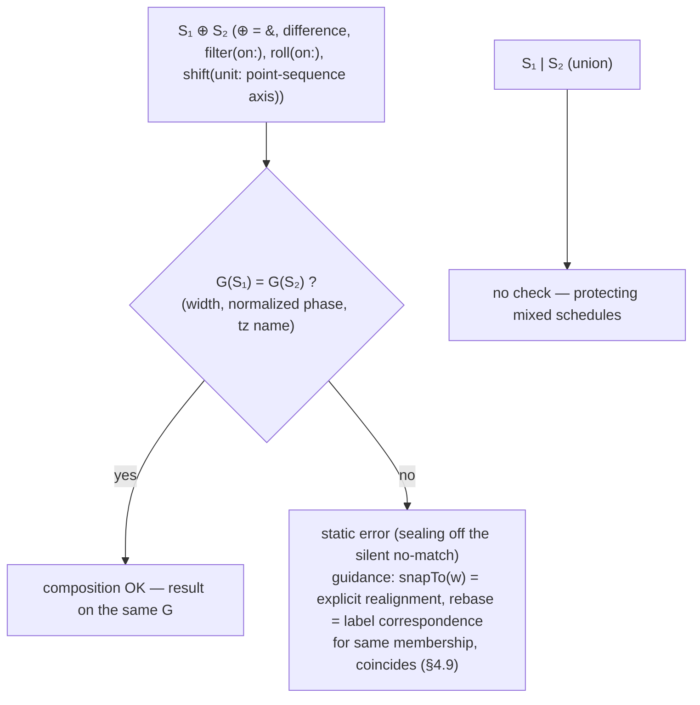
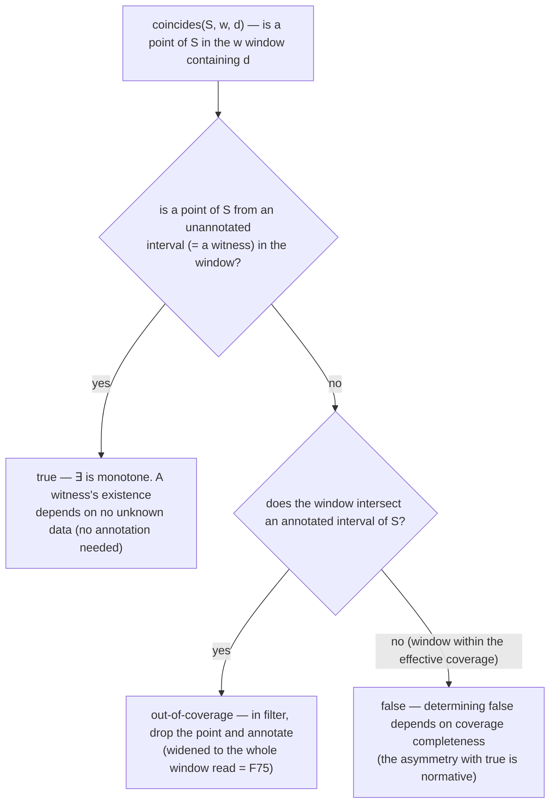
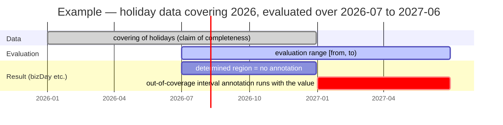
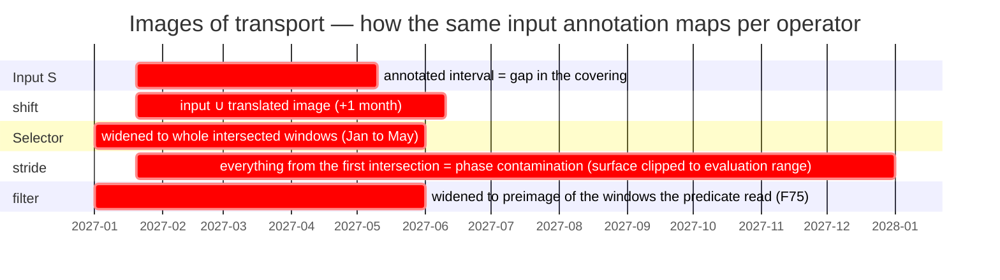
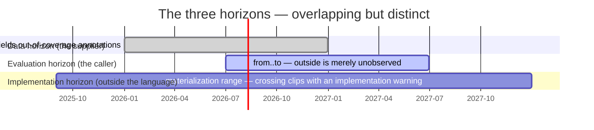

# Kairos Language Specification — 4. The Body Layer

> Translated from the canonical Japanese chapter [spec/30-body-layer.md](../../spec/30-body-layer.md).
> The `source_sha` above records the source revision; a consistency check flags this page when the
> Japanese original changes.

The body layer weaves the time stream of firing instants, using the vocabulary the premise layer
supplies. Write it in one line, with pipes, wherever possible.

## 4.1 Basic form

A body expression is pipe-centered; each stage's arguments are named, and parentheses fix them
where needed.

```text
generator |> point transform |> selector |> …
```

The preamble (premise declarations) and the body expression are kept separate (§3.2). The body
expression stays on one line wherever possible; the preamble need not.

## 4.2 Generators and windows

### Generators

`() → stream`. Calendar-system-pure, with no dependence on calendars (I8). The inventory:

- `everyDay` — streams every `day` of the in-scope calendar system.
- `everyInstant` — streams every point of the continuous base (used with `strideBy`; e.g. every
  1 sol = `everyInstant |> strideBy(24h39m35.244s, from: 2026-01-01)`. It has no upstream window,
  so the origin `from:` is mandatory — the origin rule of §4.7).
- Public boundary words of primitive definitions (`monthEnd = month |> last`, etc.) — this is
  what generators really are, not a separate mechanism (§3.6).
- Table literals (§3.8) — data-derived stream constants also stand at the head of an expression,
  on equal footing with generators.

### Windows — two kinds, two operators

Windows come in two kinds, split into separate operators. The partition type takes a window name;
the interval-sequence type takes a stream of markers. The argument kinds differ fundamentally, so the
two are not unified.

**Partition type `within(w)`** — a window that partitions the axis without remainder. `w` is a
window name (`day`/`week`/`month`/`quarter`/`year`, or a user-defined partition window), resolved
under the current premise. Exhaustiveness and non-overlap are checkable (I5).

```text
everyDay |> within(month) |> last          # last day of each month
```

**Interval-sequence type `segmentBy(m, edges:, empties:)`** — a window that cuts at the markers of an
arbitrary stream. `m` is a stream expression of markers (fiscal closes, lunar phases, and so on).
Each window is the half-open interval between adjacent markers. Exhaustiveness is not guaranteed,
so arguments that state the meaning of the gaps explicitly are mandatory (I5). Omission invites
silently wrong results, hence the mandatory declarations.

- `edges:` — the treatment of points before the first marker / after the last marker, which belong
  to no window. `drop` / `clip` / `error`.
- `empties:` — the treatment of zero-element windows between markers. `keep` (a legitimate empty)
  / `drop` / `error`.
- `labels:` — a **parallel label list for the window sequence** (the vessel for ADR-39 / F62).
  `labels[i]` attaches to the window starting at the i-th marker (**window-sequence ordinal** =
  the window of the first marker within the effective coverage is 0; defining equation `name(d)` ≡
  `labels[window-sequence ordinal]`); reading is binding-name projection (§4.9). **Same-length
  check**: list length == the coverage-based window count (= the marker count, including the final
  window fixed by the coverage edge; independent of the evaluation range = exact. A mismatch is an
  error carrying expected/actual, and runs at the same time as the evaluation of the window
  binding). Preconditions: the marker point sequence is **finite** (rule markers — the `week`
  class — are a static error; periodic labels are steered to cycle, computed numbers to
  `ordinalIn`/`label:`), and the effective coverage is a single unannotated interval enclosing all
  markers (composite markers must first be fixed by a coverage claim). Combining with
  `edges: clip`, `empties: drop`, or a `label:` lambda is a static error (every form that would
  break the label-window alignment is closed off). Empty windows (`empties: keep`) get labels too;
  the reading port is interval membership = any point within the window interval (in practice, the
  marker point). Only the **length** is guarded — checking the contents is the job of doctests and
  `coincides`.

```text
everyDay |> segmentBy(fiscalCloses, edges: clip, empties: keep) |> first
lunarMonth = day |> segmentBy(lunarStart, edges: drop, empties: error, labels: monthNos)   # lunisolar month numbers
```

## 4.3 Selectors

`first` / `nth(n)` / `last`. They select the Nth or the last element within a window. By default
they bind to the innermost window (the nearest `within`/`segmentBy`). Only when nesting makes the
target ambiguous is the window named explicitly with `of: w`. The named window carries premises
such as WKST and fixes the origin of "the Nth" (localizing the two-step dependency selector →
window → WKST). A selector without a window is a type error (I4); leaving `of:` off while
ambiguous is a static error.

```text
everyDay |> within(quarter) |> within(month) |> nth(2, of: month)  # the 2nd of each month window
everyDay |> within(quarter) |> first(of: quarter)
```

## 4.4 Point transforms (roll / shift)

Point → point, lifted to streams. Two members of one family, choosing their reference premise by
argument (`on:`/`unit:`). Each stage is self-sufficient in its premises.

- **`roll(conv, on: P)`** — nudges invalid points to valid ones by conv
  (`Following`/`Preceding`/`Modified`…). Roll conventions are axis-independent; the same system
  rides on business days and on DST alike. `Modified` takes an enclosing window as an argument and
  stays within that window. `on:` accepts derived streams as well as axis names (§3.3, ADR-26).
- **`shift(n, unit: U)`** — moves by n (signed) in units of U. **Direction is carried by the sign;
  no direction words are taken** (`back: 3` would split direction across a word and a sign once n
  becomes a variable, and complicates parsing). When unit is a point-sequence axis (`bizDay`), the
  input and the axis must agree in alignment (§4.5; window-word units are interval membership and
  exempt).
- **`snapTo(w)`** — maps each point to the **first point** of the `w` window it belongs to (floor;
  aligns granularity seams — the instant of a solar term → its day, and so on. ADR-27/30). Its
  second role: because the output is constructively aligned to `w`'s element grid, it doubles as
  the **explicit reattachment of the alignment claim** (the canonical means of conformance for the
  §4.5 checks) — identity on points already aligned (ADR-36).
- **`rebase(to: "tz")`** (ADR-40) — preserves each point's **date label** (points on an
  **established day-grid alignment** only — violation is a static error) and maps it to the first
  point of the civil day with the same date in the to tz ("the first instant" = ADR-33). The
  vessel for cross-tz "same date" composition (F69) — joint business days are
  `(tseBiz |> rebase(to: "America/New_York")) & nyseBiz`. Injective and order-preserving. A
  nonexistent date (a day erased by a date-line move) is an explicit error. The output alignment
  is the day grid of to. Choosing among the means of conformance: **snapTo = chronos membership**
  (the window containing the same instant); **rebase = label correspondence** (the same date);
  membership with time-of-day is `coincides` (§4.9 — for cross-tz, first unify the tz with
  rebase). `shift`/`roll` go **before** rebase.

```text
@JP
monthEnd |> roll(Preceding, on: bizDay) |> shift(-3, unit: bizDay)
```

## 4.5 Combinators (union, intersection, difference) and alignment

Stream × stream → stream. The same symbols serve both calendar construction in the premise layer
(adding and removing holidays) and lateral composition / exception days in the body layer.

- **Union `|`** — merger.
- **Intersection `&`** — crossing (the points contained in both).
- **Difference `\`** — removal (removes B's points from A). The symbol is **backslash U+005C**
  (distinct from the yen sign ¥ = U+00A5; even when a Japanese font shows the ¥ glyph, the code
  point is U+005C).

**Prioritized overriding (the cascade) has no symbol of its own; it is expressed by
left-associative, in-order application of union and difference.** Declaration order (the later
term) wins = last-wins, as in CSS layers. It decomposes: addition (citizens' holidays) and
movement (a substitute holiday keeps the original day and adds the next) = union; inversion and
exceptions (open for business in one particular year) = difference. Everything shares a single
precedence level, left-associative; mixtures involving `&` (intersection) are order-dependent and
must be parenthesized.

```text
# non-business-day cascade (premise layer, last wins)
weekends | statutory | substitutes \ specialBiz

# body layer (lateral composition, exception days)
tokyoBiz | osakaBiz          # union
schedule \ blackoutDays      # difference (both sides day-granular; excluding from timed streams is coincides = §4.9, ADR-38)
```

### Alignment checks (ADR-36)

Point identity is equality on chronos (ADR-33). To stop the matching of two streams of mismatched
granularity — `everyDay \ instants` never coincides at a point and is a **silent no-match** — a
static **alignment** check is placed on every operation that decides membership by point equality.

**Alignment** is a static property of a time stream — "every point lies on a tick of some **atomic
grid** G = (width, normalized phase, tz name)" — a claim computed from the derivation structure of
the expression (its value is three-way: some G, "none", or "**vacuous conformance**"; ADR-36
revision 3). **Vacuous conformance** = the alignment of the empty table (`[] covering:`, ADR-45):
having no points, it can violate no G — it **passes** the check (even against a "none" partner)
and in combination inherits the partner's alignment (in contrast to "none" = cannot claim,
**fails** the check). A window word's **element grid** = the atomic grid of its window chain (for
`month`/`year`/`week`, the `day` grid). The check at a glance:



| Form of expression | Alignment |
|---|---|
| `everyDay`, public-window-word derived (`month \|> first`, etc.) | element grid (for `Gregorian`, the `day` grid) |
| table (all elements lexically date-only) | civil-day grid (tz = the tz used to anchor the literal; entity and data premises converge to inner fixing) |
| table (containing timed or non-lexical elements) | none |
| **empty table** (`[] covering:`, ADR-45) | **vacuous conformance** (conforms vacuously to every alignment, passes the check; preserving stages preserve vacuous conformance) |
| `filter`, selectors, `within`, `segmentBy`, `stride` | preserves the input's alignment |
| `roll(conv, on: A)`, `shift(n, unit: point-sequence axis A)` | the alignment of axis A |
| `shift(n, unit: window word U)` | preserved if the input alignment = U's element grid, otherwise none (no check = interval membership) |
| `snapTo(w)` | claims w's element grid (= the **explicit means of realignment**; for windows from `segmentBy`, the markers' alignment) |
| `strideBy(w, from: p)` derived (including materialized `everyInstant`) | anchored grid (width w, anchor p) |
| `rebase(to: "tz")` | constructively claims the day grid of the to tz (= label-correspondence realignment; ADR-40) |
| `A \| B` | if both sides are identical, that; otherwise none (if one side is vacuously conformant, **inherits the other**) |
| `A & B`, `A \ B` | the common alignment (the check guarantees identity; if one side is vacuously conformant, **inherits the other**) |

**The check**: `&`, `\`, `filter(on:)`, `roll(on:)`, and `shift(unit: point-sequence axis)`
require that the alignments of both sides (input and axis) be **the same G** (`stride(n)` left the
check's scope with its input-relative fixing = ADR-38 — it reads nothing but its input, so there
is nothing to match). Either side being "none", or a G mismatch, is a static error (in the layer
after binding resolution, before data evaluation) — except that **a vacuously conformant side
always passes** (there is no point that could violate; ADR-45). There is no automatic conformance
by refinement (a lax judgment of the kind "timed and daily do line up on the tick of hours" would
let a no-match in the intended unit through). The explicit means of conformance are divided by
intent — if you want the **same points**, conform with `snapTo`; if you want the **same
membership** (the same day, etc.), use `coincides` (§4.9, ADR-38; the error message also guides
this fork). Equality of tz names is **literal string equality** (before link resolution, no
normalization; `"UTC"` ≠ `"Etc/UTC"` errs on the safe side). Union `|` asks no alignment (points
are only added, with no danger of silence — a mixed schedule is a legitimate form; the mixed
output becomes "none" and is caught by downstream checks). Operations that decide by interval
membership (`within`, `segmentBy`, `snapTo`, projections, cycle projections, `coincides`) are
outside the same-G check — but **the tz-name check is laid over the exempt family too** (ADR-36
revision 2, ADR-40): a **tz-name mismatch between a civil-grid input and the window's element grid
is a static error** (width and phase stay unexamined; once rebase makes cross-tz alignment
routine, the exempt family's "bundling with a one-day label slip, weekday reading" would pass
silently — tz alone is the date coordinate system itself. `snapTo` is excluded because chronos
membership is its documented meaning). Details in ADR-36 (including revisions).

## 4.6 Filters

Thin by predicate. Calendar dependence starts here (I8). Both forms are taken: the premise
predicate `filter(on: P)` (names an axis, resolved against the in-scope `calendar`) and the
value-expression predicate `filter(y => condition)` (a lambda) (`where` was folded in). Inside the
lambda, the value functions of cycle labels (`weekday(d) == Mon`; §3.6) and window-to-value
projections (§4.9) are available. `filter(on: P)` is membership by point equality, so it requires
the input and the axis to agree in alignment (§4.5, ADR-36 — a mismatch is a static error, never a
silent no-match).

```text
everyDay |> filter(on: bizDay)                       # keep business days only
everyDay |> filter(d => weekday(d) == Mon)           # keep Mondays only (label predicate)
```

## 4.7 Strides (scan and thin)

A stateful online transform, a family apart from selectors. Where a selector consumes a window and
picks "the Nth" window-relative (each window → one point, resetting per window), a stride consumes
no window and thins "every N" (continuous across boundaries, never resetting). "Every N business
days, ignoring month boundaries" cannot be written with selectors — that is the stride's reason to
exist. It splits into two operators by argument kind.

| Operator | Argument | What it counts | Example |
|---|---|---|---|
| `stride(n, from:)` input count | integer ≥ 1 (violation is a static error) | **points of the input stream** (no axis argument; ADR-38, F70) | `filter(on: bizDay) \|> stride(3, from: …)` = every 3 business days |
| `strideBy(w, from:)` width step | a width = a physical quantity across multiple axes | width (an absolute amount) | `strideBy(24h39m35.244s, from: …)` = every 1 sol |

`stride` is **input-relative** — what it counts is decided upstream ("every 3 business days" puts
`filter(on: bizDay)` first). The counting origin is "the **first input point** at or after
`from:`" (that point is step 0 = it survives; `from:` is not required to be a point of the input).
The form "count along an axis, apply to another stream" is composed as
`(stride sequence of the axis) & input` (day-aligned) or
`filter(d => coincides(strideSequence, day, d))` (timed; §4.9).

The origin (the phase anchor) is **always made explicit with `from:`** (absence is a static error;
common to the stride/strideBy family). The former "supplied from the upstream window's origin" was
abolished: with multiple windows it is ambiguous and evaluation-range-dependent (in tension with
I7) (ADR-31, F49). **No reset by default** (boundary-ignoring, continuous). The per-window
recounting variant is written by reduction to `ordinalIn` (§4.9, ADR-27).

```text
@JP
everyDay |> filter(on: bizDay) |> stride(3, from: 2026-01-05)    # every 3 business days (origin explicit via from:)
```

## 4.8 Sugar definitions

Sugar (`monthEnd`, `businessDays`, `nextWeekday`, etc.) is shorthand that names a composition of
the core family, erasable by expansion into core (one-way dependency). Its **definition** needs no
dedicated new syntax: write a core pipe sequence on the right-hand side of the existing binding
`=` (§3.5), nothing more. It is the same `=` binding mechanism as the §3.5 value function
`isLeap = y => …` and the §3.6 public word `monthStart = month |> first`, appearing with a
different type on the right-hand side.

**Base form B (explicit lambda)** — bind the upstream stream with `s =>` and flow it into the core
sequence with `s |>`. `|>` keeps its single meaning, "value → application of a transform".

```text
businessDays(on: p) = s => s |> filter(on: p)
nextWeekday(d)      = s => s |> roll(Following, on: (everyDay |> filter(x => weekday(x) == d)))
```

**Shorthand A (point-free)** — if the upstream `s` merely flows straight through (the head is
`s |>` and `s` appears nowhere else), `s =>` may be dropped. This is B's eta-reduction — sugar for
the sugar definition itself (self-similar). With it dropped, a transform stands to the left of
`|>`, so `|>` also carries "transform |> transform = composition". Within the frame of "connecting
stages", application and composition are distinguished by type (value or transform), and the
one-role principle is preserved.

```text
businessDays(on: p) = filter(on: p)
nextWeekday(d)      = roll(Following, on: (everyDay |> filter(x => weekday(x) == d)))
```

`nextWeekday(d)` (advance to the next d-weekday) expands to a **forward roll** — with the sequence
of d-labeled days as the axis, it nudges every non-d point to the next d-weekday. It passes
through no week window and is therefore **WKST-independent** (the former `within(week)` expansion
picked "the d-weekday of the same week window" and could jump into the past for points late in the
week; withdrawn in 40-examples F31).

Sugar that uses the upstream by name (branching and rejoining) cannot fold into A; write it as B.

**No declaration marker** — that something "is sugar (expandable into core)" is decided
automatically by dependency analysis, from the right-hand side depending only on core words (plus
default sugar). No `sugar` keyword or the like is introduced. Core words (generators, point
transforms, combinators, filters, windows, selectors, strides) are built-in reserved words of the
language; every other named binding is sugar or a public word. A binding that redefines a core
word (breaking the one-way dependency) is a static error.

**Premises are not baked in — resolution is deferred** — sugar does not fix its premises at
definition time; it resolves them against the in-scope premise at the call site. `nextWeekday`'s
`weekday` label resolves from the calling context's calendar system; the sugar itself knows no
calendar system. The `week` window's `wkst` reference (§3.6) stands on the same rule. The
complexity is borne by the core it expands into; the sugar stays thin.

**Expansion = mechanical insertion of the right-hand side** — `x |> nextWeekday(Fri)` inserts the
definition's right-hand side and opens into
`x |> roll(Following, on: (everyDay |> filter(x => weekday(x) == Fri)))`. Expand all sugar and
only core remains. The premise layer's pipe sugar (`shiftBoundary`; §3.7) is the same one-way
expansion; that one opens into the `with` of `premise → premise`.

## 4.9 Window-to-value projection (the connection to value expressions)

As the **dual** of selectors (window → point), there are projections that read a value from a
point by way of "the window it belongs to" (ADR-27/30). They are used inside value expressions
(lambdas) and, combined with `filter`, build expressions that "select by window coordinates". The
core of the reading side is these three words.

| Word | Type | Meaning |
|---|---|---|
| `ordinalIn(u, w, d)` | point → number | Within the `w` window containing point `d`, the ordinal of the `u` window containing `d` (1-based). `ordinalIn(day, month, d)` = which day of the month. The counting unit `u` is explicit, so it does not depend on the input granularity |
| `epochOrdinal(u, d)` | point → number | The running ordinal of `u` windows from the epoch (the same coordinate as the window ordinal of §3.6; **0-based**; negative before the epoch. The epoch is the language default 1970-01-01, overridable by the calendar system's `epoch:`. For data-derived windows whose sequence does not reach the epoch, **the first existing window is 0** = ADR-31 revision, F60) |
| `coincides(S, w, d)` | point → boolean | Whether at least one point of stream `S` lies within the `w` window containing point `d` (**the window-membership predicate** = bounded existential quantification in value expressions; ADR-38, F68). Alone in the family, its first argument is a stream (a window word is a static error — get a point sequence via `month \|> first`) |

`coincides` is the vessel for F68 (applying exception days to timed and mixed schedules) — the
canonical form is `notices |> filter(t => not coincides(closures, day, t))` (preserve the firing
time, exclude by "day"). The intersection form is the same single word (difference versus
intersection written by the presence or absence of `not`). Membership is interval membership, with
**no alignment requirement** (the exempt family of ADR-36 decision 7) — but if S's alignment is a
civil-time grid whose tz name disagrees with w's, it is a **static error** (preventing the silent
one-day cross-tz slip — coincides is chronos membership, not "the same date label"; F69).
Determination is the three-way **witness rule** (ADR-38 decision 4): if a point of S from an
**unannotated interval** (a witness) is in the window, true; with no witness, if the window
intersects an annotated interval of S, out-of-coverage (§4.10); if the window lies entirely within
the effective coverage, false — points of a degenerate computed value (the data-exhausted tail of
`everyDay \ holidays`) are not witnesses. Choosing between the two: for exception days between
day-aligned streams the combinator (`schedule \ blackoutDays`) is right — "same **point**:
combinator; same **membership**: coincides". The witness rule's three branches:



**Labels are read by binding name** (no generic `labelOf` word; ADR-30). Apply the **binding name
itself, as the projection name**, of a labeled window/cycle/table to a point — `weekday(d)`,
`sekki(d)`, `lunarMonth(d)`. This generalizes §3.6's "a cycle binding name is a point → label
value function" to every label source. **Points store no labels** (a time-stream point is an
instant only, and the value type is likewise untouched). A label is a point → value projection;
its sources are three — a cycle's rhythm, `label:` attachment, and calendar-coordinate value
functions — and the reading side is uniformly `name(d)`.

**Window-instance reference — the dual of binding-name projection** (ADR-42; the typing rule of
application is §2.7). Applying a **value** to a **window binding** that carries a label source
(`label:`/`labels:`) returns the contents of the windows with that label, as a time stream (the
preimage):

```text
W(v)  ≡  element point sequence of W |> filter(d => W(d) == v)      # year(2020) = the days of 2020
```

**Element point sequence** = of the input point sequence that W's definition bundled into
windows, the points that belong to W's windows (in a `grid`/`span`/`split` chain, equivalent to the atomic
grid's ticks; under `segmentBy`, the input stream's points. An internal concept — no new word for
users to write). The resolved value's alignment inherits the input's alignment, so
`marineDay & year(2020)` (narrowing to a specific year — the canonical form of F9) coexists with
the §4.5 alignment checks. When a label is not unique, the result is the **union of all matches**
(`kyuMonth("六月")` = the sixth month of every year; number labels are not unique keys —
`lunarMonth(6)` includes the leap sixth month, which repeats the preceding month's number); empty
windows and zero matches yield empty. But for bindings whose **label value domain is statically
enumerable** (`labels:` literals and the like), **an out-of-domain value argument is a static
error** (sealing off `month(2020)`-class typos going silently empty; computed labels are "no match
= empty"). The scope of application is window bindings only — preimages of cycles and tables are
not introduced, because they can be written as one `filter` line over the carrier's point sequence
(`everyDay |> filter(d => weekday(d) == Mon)`). Applying a value to a window binding with no label
source is a static error (attach `label:` or write a filter). Annotation transport is the "window
sequence → element point sequence" row (the output's annotated intervals = the complement of the
window sequence's effective coverage) plus filter's existing rule (§4.10). In the standard
premises, `year` and `month` (Gregorian) and `year` (Fiscal) carry standard labels
(`month(5) & year(2026)` = May 2026). Mind premise-relativity — under Fiscal, `year(2020)` is the
2020 **fiscal year**. If the calendar year is wanted, use the qualification pin
`Gregorian.year(2020)`.

`snapTo(w)` (§4.4) is a point transform of the same family (it reads the window's **first
point**). With this family one can write fixed days (`dayNo(d) == 11`), rokuyō
(`(month number + day ordinal) mod 6`), Easter as an instant, and "every n, reset per window"
(`filter(d => (ordinalIn(day, w, d) - 1) mod n == 0)` — the per-window-reset version of the stride
reduces to this and gets no dedicated notation). The calendar coordinates
`yearNo`/`monthNo`/`dayNo` are sugar over `epochOrdinal` + `ordinalIn` + existing value functions
(`yearOf`/`monthOf`). No value → instant lifting (`dateOf`) is introduced — projection plus
`filter` suffices.

The **attachment** side of window labels (the `label:` argument at generation time) is written as
a lambda, which **binds the window's first point (the representative point)** (ADR-34). The
semantics is the one-line defining equation
`name(d) ≡ attachExpr(first point of the window containing d)`; evaluation is at projection time,
deferred (I7); bare names inside the attachment expression are premise-relative (ADR-17). The
attachment expression may refer to any window or projection of the representative point (a
fiscal-year label `label: (p => yearNo(p))`, ordinal lookup into a parallel list), but
adjacent-window reference is out of range (I7); self-reference (label projection of the binding
name under definition, **and value-argument application** — the preimage subsumes the projection;
ADR-34 revision / ADR-42) is an explicit error (detected at projection time — bare names in the
attachment expression resolve lazily, so it cannot be decided statically); and there is no
point-±-width arithmetic in value expressions (the old example "ISO week's Thursday → year" was
transformed equivalently by F57, making the `label:` itself unnecessary). Labeled data is a point
sequence plus a parallel label list (`labels:`; §3.8, ADR-30), and **the same `labels:` attaches
to window sequences too** (§4.2, ADR-39 — the three-source symmetry: table + labels: = data labels
on points; window + label: lambda = rule labels on windows; window + labels: list = data labels on
windows. When merely pasting a data column, `labels:` is canonical; a `label:` lambda only for
computations that need an index expression). The family's names (`ordinalIn`, `epochOrdinal`,
`snapTo`, `label:`, `labels:`) were fixed at RC2 (§5.4).

## 4.10 Evaluation annotations — out-of-coverage origin (ADR-37, I6)

Data runs out (the official calendar bulletin is gazetted annually; exchange calendars extend only
through the next year). Make evaluation past the end "silently empty" and you have a silent
failure; make it "stop with an error" and every evaluation touching even part of the coverage dies
wholesale. Kairos takes a third way — **the value is always determined, and the danger is always
observable as an annotation** (the orthogonality of value determination and danger reporting; the
concretization of ADR-15's "empty is a legitimate value, origin is an evaluation annotation,
judgment is external").

**Out-of-coverage annotations**: alongside the result stream runs a **sequence of annotated
intervals** on chronos — for each [a, b): kind, source (premise.binding-name), covering, asof. For
now the kind is the single "out-of-coverage" — marking the intervals where the result **may
depend** on what lies outside the data coverage (`covering:` §3.8). Annotations attach **to
non-empty results too** (rule-derived points keep flowing in out-of-coverage intervals). **The
absence of annotations says only "not caused by a known data edge" — it is no proof of
correctness** (a typo's total drop-out goes to external judgment as an empty result with zero
annotations). An annotation is an adjunct of evaluation, not element data of the value (I6 — the
same stance as ADR-30's "points store no labels"). The relation among coverage, evaluation range,
and annotations:



The first half of 2027 still **yields values** for bizDay (degenerating to `everyDay \ satSun`) —
but the out-of-coverage annotation runs alongside, and the degeneration is **observable**. How the
annotated intervals map through each operator is the transport table below.

**Transport table**: the norm of propagation is "never miss an interval that may be depended on"
(under-approximation forbidden; over-approximation allowed). Every core operator is obliged to
have a transport row (an operator without a row cannot pass annotations through — isomorphic to
the governance table of ADR-36):

| Operator | Output's annotated intervals |
|---|---|
| combinators `\|`, `&`, `\` | the **union** of both sides (no automatic cancellation) |
| shift | input annotations ∪ the **translated image** of the annotated intervals |
| roll | the image of the input annotations ∪ the **dependency image** of the axis's annotated intervals (extended against the convention's direction to the nearest known axis point before/after). Axis exhaustion is empty + annotation; but under a completed coverage (open end), an unannotated empty |
| selectors | if the target window intersects an annotation, widened to the **whole window** |
| stride/strideBy | if the walk intersects, **everything from the first intersection onward** (phase contamination) |
| segmentBy | the complement of the marker coverage. `edges:`/`empties:` fire at the **coverage edges** (not the sequence edges) — within the coverage, even the window starting at the final marker is determined up to the coverage edge (= the window sequence's **effective coverage**) |
| filter | points that demanded an out-of-coverage reference are **dropped**, and the annotation widens to the **preimage of the region (window) the predicate read** (ADR-37 revision 2 = F75; for predicates reading only d's neighborhood, as before: the dependency's annotated intervals ∩ the evaluation region) |
| generators, within, snapTo | pass the input's annotations through (point transforms, via the image). A calendar-system-pure generator itself produces no annotations |
| rebase | inflate the endpoints to the source's day windows by floor/ceil, then map by label correspondence (over-approximation allowed; ADR-40) |

The table's images laid out on one chart — an input S depending on a gap in the covering
〔2027-01-20, 2027-05-10〕 (the out-of-coverage annotation stands on that interval), passed through
each operator over the evaluation range [2026-07-01, 2028-01-01); shown are the output's annotated
intervals. shift is `shift(+1, unit: month)`; the selector and the filter read month windows
(`first(of: month)`, a coincides-class predicate). The combinators' union and roll's dependency
image are as in the table:



The point: only stride fails to close on the right (even when the data returns past the gap, the
walk's phase is already contaminated). The selector's and the filter's images coincide because in
this example both read the same month windows.

Cancellation under composition is done only by an **explicit coverage claim** (the binding postfix
`covering:`; §3.8). Premise bindings acquire their annotations **per evaluation**, not at
definition (nothing is baked into the definition).

**The error classifier**: a failed reference (a point absent from the column in table projection;
no window membership; no landing point for roll/shift; parallel-list indexing) is classified
"out-of-coverage" when the failing point lies outside **the effective coverage of the binding that
the reference actually reads** (in stream context, drop and annotate; in pure-value context, an
explicit error classified out-of-coverage); inside it, a hard error as before (mix-ups stay under
ADR-16's governance). Multi-dependency cases are classified by the failed reference's dependency
alone; when both stories would explain it, err on the safe side = hard error.

**The vessels are two** (the implementation surface of "judgment is external"; the canonical form
is the reference implementation): (a) **interval annotations** — clipped to the evaluation range
[from, to) and returned on equal footing with the result (clipping happens once, at the surface;
internal propagation is unclipped). (b) **the coverage summary** — for each data source
referenced, returns 〔source, covering, asof, completion claim, **runway** from the evaluation's
to〕 without clipping (watching for "the data runs out right after to"; making completion claims
observable). The response — fail, warn, or proceed — is the caller's responsibility (ADR-15).

**The two horizons**: do not confuse the data coverage (covering:, the source of annotations) with
the evaluation range (from/to, the clipping frame of annotations). A narrow evaluation fitting
inside the coverage runs with zero annotations ("do not kill narrow evaluation ranges"). An
implementation's materialization range is a third, approximate horizon absent from the language
(crossing it is clipping plus an implementation warning — neither an annotation nor a hard error).
The three overlap but are distinct — different owners, different consequences of crossing:


