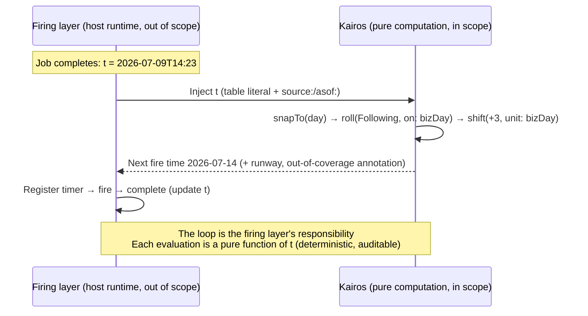
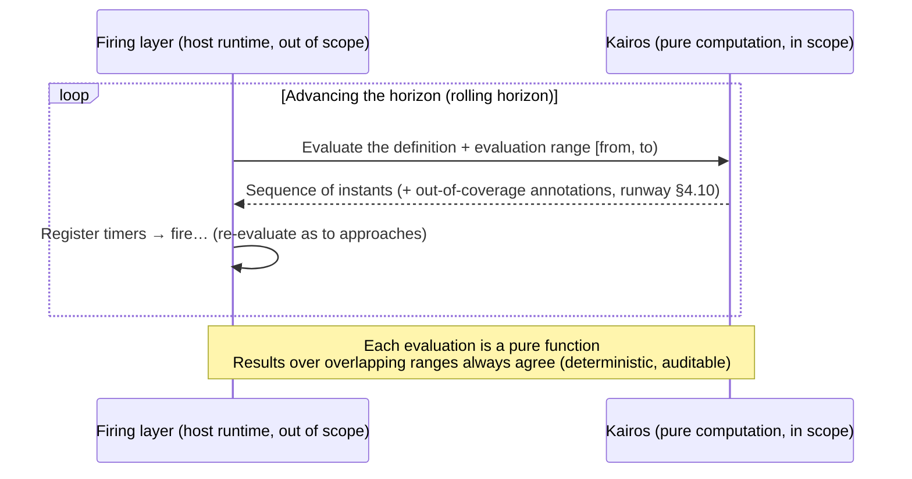

# Kairos Language Specification — 7. Worked Examples

> Translated from the canonical Japanese chapter [spec/90-examples.md](../../spec/90-examples.md).
> The `source_sha` above records the source revision; a consistency check flags this page when the
> Japanese original changes.

Each example is shown both as sugar (the everyday form) and as its core expansion. All sugar expands
into core, and the semantics live in core (§4.8).

## 7.1 Three business days before every month-end

```text
# sugar
@JP
monthEnd |> roll(Preceding, on: bizDay) |> shift(-3, unit: bizDay)

# core expansion
@JP
everyDay |> within(month) |> last |> roll(Preceding, on: bizDay) |> shift(-3, unit: bizDay)
```

Bundle all days by month, take the last day of each month, roll it back to the previous business day
if it is not one, and step back 3 business days from there. `monthEnd` is calendar-system pure (I8),
so it yields the *calendar* month-end; adjusting to business days is the job of the later `roll`
stage. `on: bizDay` resolves to the **standard derivation** from `@JP`'s `calendar: TSE`
(`everyDay \ TSE.nonWorking`; §3.9, ADR-35). Folding the axis into the trailing declaration —
`@JP axis: bizDay` — lets you omit `on:`/`unit:` under it (§3.3; directly naming the entity,
`axis: TSE`, also works).

## 7.2 The next Friday after the 2nd business day of each month

```text
# sugar
@JP
everyDay |> businessDays(on: bizDay) |> within(month) |> nth(2) |> nextWeekday(Fri)

# core expansion
@JP
everyDay |> filter(on: bizDay) |> within(month) |> nth(2)
         |> roll(Following, on: (everyDay |> filter(x => weekday(x) == Fri)))
```

From all days keep only the business days, bundle them by month, take the 2nd in each month window,
and advance to the next Friday. `nextWeekday(Fri)` expands to a **forward roll** (rolling onto the
axis of Friday-labeled days; §4.8); it never passes through a week window, so it is
**WKST-independent**. If the 2nd business day is itself a Friday, it stays put (a valid point does
not move). `businessDays(on: p) = filter(on: p)` is minimal sugar — a **transform** (a stage) — and
it cannot appear in generator position (mechanical insertion, §4.8, would then fail to produce a
core form; calendar-dependent generators are also a rejected alternative of ADR-20; F45).

## 7.3 Defining a fiscal calendar (April start)

```text
# sugar (everyday form)
premise Fiscal = Gregorian |> shiftBoundary(+3, on: year, unit: month)

# core expansion (with-override)
premise Fiscal = Gregorian with {
  year = month span (_ => 12) phase: 3 label: (p => yearNo(p))   # label: is not inherited by an override = supply it at the same time (F96)
}
```

All this does is recompose `Gregorian`'s `year` into "bundle calendar months by 12, starting in
April". `month` is untouched, so calendar days and month-ends stay fixed (§3.7). `quarter`'s
inherited definition (`year split by month`) automatically follows the new `year`, yielding fiscal
quarters (Apr–Jun/…). `shiftBoundary` expands into a single phase shift of the `span` (`k=12`,
`φ₀=0`, `δ=+3`).

The fiscal calendar can be used with the same standing as the original. Lay
`calendar-system: Fiscal` in the preamble of a body expression, and every subsequent `within(year)`
bundles by fiscal year.

```text
premise FY { calendar-system: Fiscal; calendar: TSE; tz: "Asia/Tokyo"; wkst: Mon }
@FY
everyDay |> within(year) |> first          # the first day of each fiscal year (the April 1sts)
```

## 7.4 Payday (the 25th of every month; previous business day if a holiday)

```text
@JP
everyDay |> within(month) |> nth(25) |> roll(Preceding, on: bizDay)
```

Take the 25th day of each month window and roll back to the previous business day if it is not one.
A frequent pattern of the same shape as 7.1.

## 7.5 The holiday cascade (substitute holidays, citizens' holidays)

```text
@JP
nonHoliday  = everyDay \ statutory                    # statutory = the union of holidays (fixed dates, Nth Mondays, gazette notices, …)
substitutes = statutory |> filter(d => weekday(d) == Sun) |> roll(Following, on: nonHoliday)
sandwiched  = ((statutory |> shift(+1, unit: day)) & (statutory |> shift(-1, unit: day))) \ statutory
holidays    = statutory | substitutes | sandwiched    # cascade (union, last wins)
```

Substitute holidays = forward-roll the Sunday holidays along the "non-holiday days" axis (runs of
consecutive holidays are jumped over automatically). Citizens' holidays = the **intersection** of
"the day after a holiday" and "the day before a holiday", minus the holidays themselves. The moved
days are added by union (the original Sundays remain) — the decomposition into prioritized
overrides (§4.5) corresponds directly to the structure of the statute text. Exhaustive verification
is in `../../design/40-examples/01-jp-holidays.md`.

## 7.6 The year's zodiac branch (eto)

```text
premise JPEto = Gregorian with {
  yearBranch = year cycle [子, 丑, 寅, 卯, 辰, 巳, 午, 未, 申, 酉, 戌, 亥] anchor: 2020-01-01  # 2020 = 子
}
@JPEto
everyDay |> within(year) |> first |> filter(d => yearBranch(d) == 午)   # New Year's Day of 午 years (2026, 2038, …)
```

`cycle` is arbitrary in both period length and target (§3.6). The year window containing `anchor:`
receives the first label (子), and labels are read through value-expression predicates
(`yearBranch(d) == 午`). Verification of the daily sexagenary (stem-branch) cycle, rokuyō, and the
like is in `../../design/40-examples/02-cycles.md`.

## 7.7 Next-fire computation from an injected instant — how to correctly write "N business days after the last completion"

The first question anyone migrating from the cron family runs into: can you write something
**relative to the execution origin**, like "3 business days after the last completion"? The answer
comes in two parts.

- **You cannot (deliberately out of scope, §1)**: writing "every 5 hours since the last completion,
  reset on each completion" as a **single infinite stream**. That is feedback — the expression's
  output (an execution result) loops back into its input — and it breaks purity (I7) and
  extensionality (expression = set of instants).
- **You can (in scope from the start)**: the "next fire time" from a **given** single point t. With
  t fixed, it is a deterministic calendar computation — a pure function — and all the vessels it
  needs already exist: "some instant" is a **single-element table literal** (§3.8), and business-day
  arithmetic is `roll` + `shift` (§4.4):

```text
@JP
lastCompleted = [2026-07-09T14:23] covering: ..     # the "last completed" injected by the firing layer (with source:/asof:)
lastCompleted |> snapTo(day) |> roll(Following, on: bizDay) |> shift(+3, unit: bizDay)
#=> 2026-07-14
```

The "last completed" is injected as **external data** with the same standing as holiday data (the
data-supply decoupling of ADR-15). The re-evaluation loop — swapping in a new t on each completion
— is the responsibility of the firing layer (the host runtime), and the division of labor with the
language closes into the following shape:



Key points:

- **Each evaluation is a pure function** — the same t always yields the same next fire time (safe
  under restarts, replays, and audits).
- **Annotations come along** — because it depends on `bizDay`, a next-fire computation beyond the
  end of the holiday data carries an out-of-coverage annotation and a runway alongside it (§4.10;
  for the firing layer this becomes the operational signal "the data needs updating").
- **Alignment governance stops malformed shapes** — feeding a time-bearing t straight onto the
  `bizDay` axis is a static error (§4.5). Explicitly dropping to day granularity with `snapTo(day)`
  is canonical. The elapsed form ("5 hours later") is simply `shift(+5, unit: hour)`.
- Executed verification (4 doctests) and measurements of the malformed shapes are in
  `../../design/40-examples/07-injected-origin.md`. Implementation work on the firing-layer side
  happens in the target implementation project (private).

## 7.8 Division of labor with the firing layer (general form) — the time-stream consumption loop

§7.7 was the special form "next-fire computation from a single injected point". In the general form
— the host runtime (the firing layer) consuming an **arbitrary** Kairos definition (a time stream)
— the division of labor closes on the same principle: **the language only returns the set of
instants (the extension) for an evaluation range** (§1.4), and the whole loop of timer registration,
firing, and re-evaluation is the firing layer's responsibility.



Key points:

- **Determinism** — the same definition, the same evaluation range, and the same data (asof;
  external 〈§3.8, ADR-46〉 is **relative to the same snapshot** — resolved values are fixed within
  an evaluation, and data updates between evaluations are observed through asof and the coverage
  summary) always yield the same sequence. Even when the horizon advances and the definition is
  re-evaluated, **the instants in the overlapping interval agree** (the evaluation range is "where
  to look", not "where to count from" — the origin belongs to the expression side, via `from:` and
  the like; a consequence of ADR-31). The firing layer can overlap evaluations with confidence.
- **Enumerating missed-fires** — pass the downtime period [down, up) as the evaluation range, and
  the instants that should have fired during it come back **as a sequence** (a scanOnBoot-class
  cron feature, with nothing added on the language side — a consequence of the extensionality of
  definition = set of instants).
- **Operational signals** — instants beyond the end of holiday data and the like carry
  out-of-coverage annotations and a runway alongside them (§4.10). The firing layer can consume
  these as the machine-readable signal "the data needs updating".
- Anything relative to the execution origin, like "since the last completion", decomposes into the
  special form that injects t as external data (§7.7).
- All three properties (determinism, missed-fire, operational signals) have been measured in the
  (private) application study on a host runtime — confirming exact agreement on overlapping
  intervals, enumeration of unfired instants over a downtime period, and data-exhaustion
  annotations serving as operational signals.
