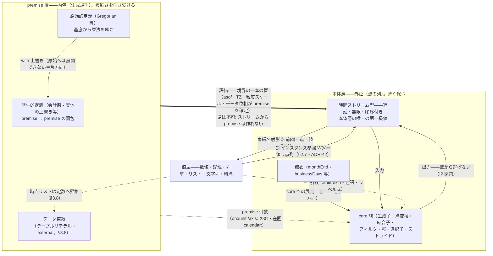

# Kairos 言語仕様 — 2. 型と層

## 2.1 二層構造

Kairos は二層からなる（SQL の DDL/DML に対応）。

- **premise 層** — 暦法・カレンダーを組み立てる。多行・宣言的でよい。何が「月」で何が「営業日」かを定義する層。
- **本体層** — スケジュールを紡ぐ。可能な限り一行・パイプ的。定義済みの語彙を使って発報時点を導く層。

両層は同じストリーム語彙を共有するが、型は分かれる。複雑さは premise 層が引き受け、本体層は薄く保たれる。

## 2.2 三つの型

### 時間ストリーム型（本体層の第一級値）

遅延・無限・順序付きの、基底 Chronos 上の点の列。同じ定義なら等価。これは**外延**（生成された点の列）であり、
本体層の唯一の第一級の値。本体層の中では型は一本に保つ。

### premise 型（内包・生成規則）

暦法・カレンダーなどの生成規則そのもの。時間ストリーム型が外延なら、premise 型はその**内包**。原始的定義と
派生的定義があり（§3.6/§3.7）、派生は `premise → premise` の閉包で premise 型の中に閉じる。原始と派生は同じ型。

### 値型（数値・論理・列挙・リスト・文字列・時点）

時間ストリームでない値。数値・論理・列挙（`Mon`・`Preceding` 等）・リスト（`[…]`・添字・所属述語 `in`）・
文字列（`"Asia/Tokyo"`。TZ・出所の値。ADR-32）・**時点**（日付リテラルの値・ラムダが束縛する点も同じ内訳。
裸の値束縛 `d0 = 2026-05-15` も合法＝ADR-43/F97——同じ日付を `anchor:`/`from:` とテーブルで二度書く重複が
消える）。暦法定義の規則（閏年判定など。§3.6）や本体層の引数（`shift(n)` の
`n`）で使う。時間ストリーム型・premise 型と並ぶ第三の型。時点を要素とするリストは時間ストリーム定数に昇格する
（テーブルリテラル §3.8・ADR-26。空リスト `[]` は `covering:` 後置に限り昇格＝空テーブル・ADR-45）。

premise を評価すると時間ストリームが出る（逆は不可）。両層は非対称で、境界に基底座標（asof・TZ・粒度スケール・
データ位相 §3.8）が premise を確定する一本の管がある。三つの型と両層の全体像（§2.3 の閉包・§2.4 の
片方向階層を図に含む）:

## 2.3 閉包

全演算子は `(ストリーム…, premise) → ストリーム`。型から逃げない。これにより「導いた日を基準にさらに別の定義を
作る」——既存言語が持たなかった合成が可能になる。一枚岩の式ではなく、各段が前段の出力を入力に取るパイプで書ける。

## 2.4 二つの対称な階層（core/糖衣、原始/派生）

複雑さと略記を分ける同じ構図が両層に現れる。

- **本体層: core 族と糖衣** — core 族（生成子・点変換・結合子・フィルタ・窓・選択子・ストライド）は最小で厳密。
  糖衣（`monthEnd`・`businessDays`・`nextWeekday` 等）はその合成に名を付けた略記で、core への展開で消せる。
  依存は**片方向**（糖衣 → core）で、糖衣層のバグは core に伝播しない。日常は糖衣で短く、意味論は core で厳密。
- **premise 層: 原始的定義と派生的定義** — 原始（`Gregorian` 等）は基底から暦法を組み、派生（会計暦等）は既存
  premise を上書きして作る。派生は原始へは展開できない（新しい規則だから）。同じ片方向の非対称。

## 2.5 記号は三役に一対一

記号の役割は重ねない。段の連結・名前空間参照・ストリーム和を、別々の記号に一対一で割り当てる。

| 記号 | 役 |
|---|---|
| `\|>` | 段の連結（時間ストリームを次段へ流す。premise 層では premise → premise を繋ぐ） |
| `.` | premise 修飾（名前空間の階層参照。`Gregorian.month`） |
| `\|` | 結合子（ストリームの和。積 `&`・差 `\` と対をなす。§4.5） |

## 2.6 不変条件

言語が構造的に守る性質（詳細は `10-domain-model.md`・`20-adr/`）。

- **I1 基底固定** — 全要素は単一基底 Chronos 上の点。全暦法・粒度はその射影。
- **I2 閉包** — 全演算子は `(ストリーム…, premise) → ストリーム`。
- **I3 明示解決** — 無効・不在に着地し得る演算子は、ロール規約と錨解決を必須引数に取る（サイレントバグを構文上
  不能に）。
- **I4 窓相対** — 選択子は常に包含窓に相対的。窓なしの選択子は型エラー。「第 N」は窓の起点にも依存（二段依存）。
- **I5 網羅性検証** — パーティション型窓は軸の網羅と無重複が検査可能。区間列型は隙間の意味を明示。
- **I6 文脈流し** — TZ・WKST・asof・範囲外の出自（区間註釈）は、要素データでなく評価文脈・評価註釈として
  流す（「空の出自」は区間の出自へ一般化——空でない結果にも付く。§4.10・ADR-15 改訂/37）。
- **I7 純粋・遅延** — 無限ストリーム上で各演算子はオンラインに定義される。
- **I8 生成子純粋** — 生成子は暦法だけに依存し、カレンダー（営業日・祝日）に依存しない。カレンダー依存は
  点変換・フィルタ・結合子以降に限る（差 `\` が入口になる形＝bizDay 標準導出・ADR-35）。

## 2.7 適用の型規則——位置依存の名前解釈（ADR-42）

同じ名前が、出現位置と引数の型に応じて異なる解釈を受ける。統治は一つ:
**候補集合を出現位置の期待型で絞り、絞った後に複数の解釈が残るなら黙って選ばない＝曖昧エラー**
（ADR-17・ADR-35 判断 4 と同じ面）。この原理の実例が三面ある。

| 位置 | 名前の種別 | 解釈 | 詳細 |
|---|---|---|---|
| 軸位置（`on:`/`unit:`/`axis:`） | premise 名 | 実体の正体判定＋標準導出への読み替え | §3.9・ADR-35 判断 4 |
| 適用・**点**引数 `W(d)` | ラベル源つき束縛 | 束縛名射影（点→値） | §4.9・ADR-30/34/39 |
| 適用・**値**引数 `W(v)` | ラベル源つき**窓**束縛 | 窓インスタンス参照（値→点列）＝逆像 | §4.9・ADR-42 |

dispatch（点か値かの判定）は引数**式**の型で一意に分岐する。ラムダ変数の型は**束縛サイトの文脈**で
確定し（`filter`/`label:` のラムダは点・`span` のラムダは窓序数＝数値・値関数は本体の型付けから）、
判定時点は**糖衣展開後・実引数束縛後**（整列 §4.5 と同じ計算時点）——判定時点では実引数の型が常に
一意なので、適用位置で曖昧エラーは構造上発火しない。自由なラッパ（`f = v => year(v)`）は呼び出し
ごとに型が確定する（多相を許容）。`W(v)` はストリーム期待位置のすべてで合法（頭位置・結合子
被演算子・`on:`/`unit:`・`coincides` の S スロット等）、純値位置（`x = year(2020) + 1`）は型エラー
（ストリームは値式に混ざれない＝§2.2 の型分離）。時点は値型の一員（§2.2・ADR-43）で、dispatch は
「点→射影・**点以外の値**→インスタンス参照」——日付リテラルも点を握った値変数も射影に分岐する
（`year(2026-05-15)`＝`year(d0)`＝射影＝`2026`）。
