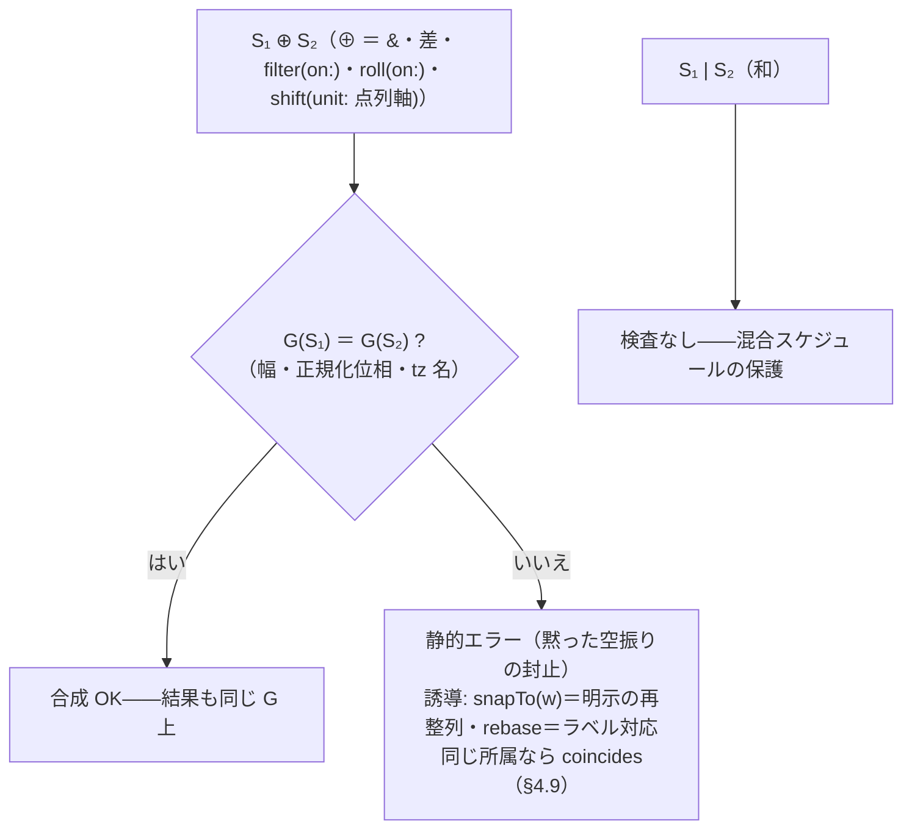
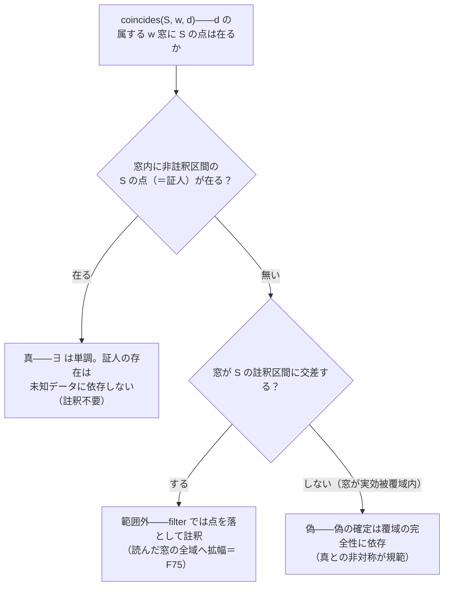
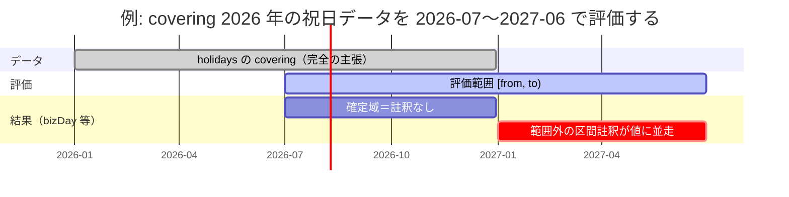

# Kairos 言語仕様 — 4. 本体層

本体層は、premise 層が供給する語彙を使って発報時点の時間ストリームを紡ぐ層である。可能な限り一行・パイプで書く。

## 4.1 基本形

本体式はパイプ主体で、各段の引数は名前付き、必要に応じ括弧で確定する。

```text
生成子 |> 点変換 |> 選択子 |> …
```

前文（premise 宣言）と本体式は分割する（§3.2）。本体式は可能な限り一行、前文は一行にこだわらない。

## 4.2 生成子と窓

### 生成子

`() → ストリーム`。暦法純粋でカレンダーに依存しない（I8）。目録は次の通り。

- `everyDay` — 在圏暦法の全 `day` を流す。
- `everyInstant` — 連続基底の全点を流す（`strideBy` と併用。例: 1 sol ごと＝`everyInstant |>
  strideBy(24h39m35.244s, from: 2026-01-01)`。前段窓を持たないため起点 `from:` は必須——§4.7 の起点規則）。
- 原始的定義の公開境界語（`monthEnd = month |> last` 等）——生成子の正体はこれで、別機構ではない（§3.6）。
- テーブルリテラル（§3.8）——データ由来のストリーム定数も生成子と同格に式の先頭に立てる。

### 窓 — 二種を別演算子に

窓は二種を別演算子に分ける。パーティション型は窓名を、区間列型はマーカーのストリームを取り、引数の種類が根本的に
違うため一本化しない。

**パーティション型 `within(w)`** — 軸を余さず分割する窓。`w` は窓名（`day`/`week`/`month`/`quarter`/`year`、または
ユーザ定義のパーティション窓）で、現在の premise の下に解決される。網羅・無重複が検査可能（I5）。

```text
everyDay |> within(month) |> last          # 各月の最終日
```

**区間列型 `segmentBy(m, edges:, empties:)`** — 任意ストリームのマーカーで切る窓。`m` はマーカーのストリーム式
（決算期・月相など）。窓は隣り合うマーカーの半開区間。網羅は保証されないため、隙間の意味を明示する引数を必須と
する（I5）。省略はサイレントな誤結果を招くため宣言必須。

- `edges:` — 最初のマーカー前／最後のマーカー後の、どの窓にも属さない点の扱い。`drop`／`clip`／`error`。
- `empties:` — マーカー間の要素ゼロ窓の扱い。`keep`（正当な空）／`drop`／`error`。
- `labels:` — **窓列への並行ラベル列**（ADR-39・F62 の器）。`labels[i]` は第 i マーカー起点の窓に付き
  （**窓列序数**＝実効被覆域内の先頭マーカー窓が 0。定義的等式 `名前(d)` ≡ `labels[窓列序数]`）、
  読みは束縛名射影（§4.9）。**同長性検査**: リスト長 == 覆域基準の窓数（マーカー数・覆域端確定の
  最終窓込み・評価範囲非依存＝正確。ずれは期待/実際つきエラー・窓束縛の評価と同時に走る）。前提:
  マーカー点列は**有限**（規則マーカー〈week 級〉は静的エラー——周期ラベルは cycle・計算番号は
  `ordinalIn`/`label:` へ誘導）・実効被覆域は全マーカーを包む単一の無註釈区間（合成マーカーは被覆
  主張で確定してから）。`edges: clip`・`empties: drop`・`label:` ラムダとの併用は静的エラー
  （整列を崩す形はすべて締める）。空窓（`empties: keep`）にもラベルは付き、読み口は区間所属＝
  窓区間内の任意の点（実用上はマーカー点）。守るのは**長さ**のみ——中身の照合は doctest・
  `coincides` の分担。

```text
everyDay |> segmentBy(fiscalCloses, edges: clip, empties: keep) |> first
lunarMonth = day |> segmentBy(lunarStart, edges: drop, empties: error, labels: monthNos)   # 旧暦月番号
```

## 4.3 選択子

`first`／`nth(n)`／`last`。窓内で第 N 番・最後を選ぶ。既定で最内窓（直近の `within`/`segmentBy`）に束縛される。
入れ子で対象が曖昧なときのみ `of: w` で窓を明示する。名指しした窓が WKST 等の premise を背負い、「第 N」の起点を
定める（選択子 → 窓 → WKST の二段依存を局所化）。窓なしの選択子は型エラー（I4）、曖昧なまま `of:` を省くのは
静的エラー。

```text
everyDay |> within(quarter) |> within(month) |> nth(2, of: month)  # 各月窓の第 2
everyDay |> within(quarter) |> first(of: quarter)
```

## 4.4 点変換（roll / shift）

点 → 点 をストリームに持ち上げたもの。同じ族の二メンバーで、参照 premise を引数（`on:`/`unit:`）で選ぶ。各段が
premise を自足する。

- **`roll(conv, on: P)`** — 無効点を conv（`Following`/`Preceding`/`Modified`…）で有効点へ寄せる。ロール規約は
  軸非依存で、営業日にも DST にも同じ体系が乗る。`Modified` は上位窓を引数に取り、その窓内に留める。
  `on:` には軸名のほか導出ストリームも渡せる（§3.3・ADR-26）。
- **`shift(n, unit: U)`** — U 単位で n（符号つき）だけ動かす。**方向は符号で表し、方向語は採らない**（`back: 3` は
  n を変数化したとき方向が語と符号に二重化し解析も煩雑）。unit が点列軸（`bizDay`）のときは入力と軸の
  整列一致を要する（§4.5。窓語 unit は区間所属で対象外）。
- **`snapTo(w)`** — 各点をその属する `w` 窓の**先頭点**へ写す（floor。節気の瞬間→その日、など粒度の
  継ぎ目を揃える。ADR-27/30）。第二の役割: 出力は構成的に `w` の要素グリッドに整列するため、
  **整列主張の明示的な付け替え**（§4.5 の検査への正準の整合手段）を兼ねる——既に整列している点には
  恒等（ADR-36）。
- **`rebase(to: "tz")`**（ADR-40）— 各点（**既定整列の day グリッド**の点に限る——違反は静的
  エラー）の**日付ラベル**を保存して、to tz の同日付の市民日の先頭点（「最初の瞬間」＝ADR-33）へ
  写す。クロス tz の「同じ日付」合成の受け皿（F69）——共通営業日は `(tseBiz |> rebase(to:
  "America/New_York")) & nyseBiz`。単射・順序保存。存在しない日付（日付変更線の移動で消えた日）は
  明示エラー。出力整列は to の day グリッド。整合手段の使い分け: **snapTo＝chronos 所属**（同じ瞬間を
  含む窓）・**rebase＝ラベル対応**（同じ日付）・時刻つきの所属は `coincides`（§4.9——クロス tz は
  rebase で同 tz 化してから）。`shift`/`roll` は rebase の**前段**で。

```text
@JP
monthEnd |> roll(Preceding, on: bizDay) |> shift(-3, unit: bizDay)
```

## 4.5 結合子（和・積・差）と整列

ストリーム × ストリーム → ストリーム。premise 層のカレンダー構築（祝日の増減）と本体層の横合成・例外日の両方で
同じ記号を使う。

- **和 `|`** — 合併。
- **積 `&`** — 交叉（両方に含まれる点）。
- **差 `\`** — 除去（A から B の点を除く）。記号は**バックスラッシュ U+005C**（円記号 ¥＝U+00A5 とは別物。日本語
  フォントで ¥ のグリフに見えてもコードポイントは U+005C）。

**優先度付き上書き（カスケード）は独立記号を持たず、和・差の左結合順序適用で表す。** 宣言順（後の項）が優先＝
CSS レイヤーの後勝ち。加算（国民の休日）・移動（振替休日は元日を残し翌日を足す）＝和、反転・例外（ある年だけ営業
に）＝差、と分解できる。すべて同一優先度・左結合とし、`&`（積）が絡む混在は順序依存のため括弧で明示する。

```text
# 非営業日カスケード（premise 層、後勝ち）
weekends | statutory | substitutes \ specialBiz

# 本体層（横合成・例外日）
tokyoBiz | osakaBiz          # 和
schedule \ blackoutDays      # 差（両辺とも日単位のとき。時刻付きからの除外は coincides＝§4.9・ADR-38）
```

### 整列（alignment）の検査（ADR-36）

点の同一性は chronos 上の等値（ADR-33）である。粒度のそろわない二流の突合——`everyDay \ 瞬間列` は
点が一致せず**黙って空振り**する——を止めるため、点の等値で所属を判定する演算に**整列**の静的検査を置く。

**整列**とは、時間ストリームの静的性質「全点が、ある**原子グリッド** G＝（幅・正規化位相・tz 名）の
目盛り点上にある」という、式の導出構造から計算される主張（値は G か「なし」か「**空虚適合**」の
三値。ADR-36 改訂 3）。**空虚適合**＝空テーブル（`[] covering:`・ADR-45）の整列で、点が無いため
どの G にも違反し得ない——検査には**通り**（相手が「なし」でも通す）、結合では相手の整列を継承する
（「なし」＝主張できない・検査に**落ちる**、との対比）。窓語の**要素グリッド**＝
その窓連鎖の原子 grid（`month`/`year`/`week` なら `day` の grid）。検査の全体像:



| 式の形 | 整列 |
|---|---|
| `everyDay`・公開窓語由来（`month \|> first` 等） | 要素グリッド（`Gregorian` なら `day` の grid） |
| テーブル（全要素が日付のみの字句） | 市民日グリッド（tz＝リテラルの錨打ちに使われた tz。実体・データ premise は内側固定に収束） |
| テーブル（時刻付き・字句でない要素を含む） | なし |
| **空テーブル**（`[] covering:`・ADR-45） | **空虚適合**（全整列に空虚に適合・検査に通る。保存系の段は空虚適合を保存） |
| `filter`・選択子・`within`・`segmentBy`・`stride` | 入力の整列を保存 |
| `roll(conv, on: A)`・`shift(n, unit: 点列軸 A)` | 軸 A の整列 |
| `shift(n, unit: 窓語 U)` | 入力整列＝U の要素グリッドなら保存、さもなくば なし（検査なし＝区間所属） |
| `snapTo(w)` | w の要素グリッドを主張（＝**再整列の明示手段**。segmentBy 由来の窓ではマーカーの整列） |
| `strideBy(w, from: p)` 由来（`everyInstant` の実体化を含む） | anchor 付きグリッド（幅 w・anchor p） |
| `rebase(to: "tz")` | to tz の day グリッドを構成的に主張（＝ラベル対応の再整列。ADR-40） |
| `A \| B` | 両辺同一ならそれ、さもなくば なし（片辺が空虚適合なら**相手を継承**） |
| `A & B`・`A \ B` | 共通整列（検査で同一が保証される。片辺が空虚適合なら**相手を継承**） |

**検査**: `&`・`\`・`filter(on:)`・`roll(on:)`・`shift(unit: 点列軸)` は、両辺（入力と軸）の
整列が**同一の G** であることを要求する（`stride(n)` は入力相対の確定＝ADR-38 で対象から外れた——
入力しか読まないので突合が無い）。どちらかが「なし」でも、G 不一致でも静的エラー（束縛解決後・
データ評価前の層）——ただし**空虚適合の辺は常に通る**（違反しうる点が無い。ADR-45）。細分による自動整合はしない（「時刻付きと日次は時の目盛りでは揃う」式の緩い判定は、
意図の単位での空振りを通してしまう）。整合の明示手段は意図で分ける——**同じ点**が欲しいなら `snapTo`
で整合、**同じ所属**（同じ日、など）が欲しいなら `coincides`（§4.9・ADR-38。エラーの文言もこの分岐を
案内する）。tz 名の等値は**リテラル文字列の等値**
（リンク解決前・正規化なし。`"UTC"` ≠ `"Etc/UTC"` は安全側エラー）。和 `|` は整列不問（点は足されるだけで
黙る危険が無い——混合スケジュールは正当な形。混合出力は「なし」となり後段の検査に掛かる）。
区間所属で判定する演算（`within`・`segmentBy`・`snapTo`・射影・cycle 射影・`coincides`）は同一 G の
検査の対象外——ただし**免除系にも tz 名の検査は敷く**（ADR-36 改訂 2・ADR-40）: 市民グリッド入力と
窓要素グリッドの **tz 名不一致は静的エラー**（幅・位相は不問のまま。rebase がクロス tz 整列を常態化
させると、免除系の「ラベル 1 日ずれの束ね・曜日読み」が黙って通るため——tz だけは日付座標系
そのもの。`snapTo` は chronos 所属が文書化済みの意味なので除外）。詳細は ADR-36（改訂含む）。

## 4.6 フィルタ

述語で間引く。カレンダー依存はここ以降（I8）。premise 述語 `filter(on: P)`（軸を名指し在圏 `calendar` に解決）と、
値式述語 `filter(y => 条件)`（ラムダ）の両方を取る（`where` を統合）。ラムダの中では cycle ラベルの値関数
（`weekday(d) == Mon`。§3.6）と窓→値の射影（§4.9）が使える。`filter(on: P)` は点の等値所属なので、
入力と軸の整列一致を要求する（§4.5・ADR-36——不一致は黙って空振りせず静的エラー）。

```text
everyDay |> filter(on: bizDay)                       # 営業日だけ残す
everyDay |> filter(d => weekday(d) == Mon)           # 月曜だけ残す（ラベル述語）
```

## 4.7 ストライド（走査して間引く）

選択子とは別族の状態付きオンライン変換。選択子が窓を消費して窓相対に「第 N」を選ぶ（各窓→1 点・窓ごとリセット）の
に対し、ストライドは窓を消費せず「N ごと」に間引く（境界を無視して連続・リセットしない）。「月境界を無視して N
営業日ごと」は選択子では書けず、これがストライドの存在意義。引数の種類で二演算子に割る。

| 演算子 | 引数 | 数えるもの | 例 |
|---|---|---|---|
| `stride(n, from:)` 入力カウント | 1 以上の整数（違反は静的エラー） | **入力ストリームの点**（軸引数なし。ADR-38・F70） | `filter(on: bizDay) \|> stride(3, from: …)`＝3 営業日ごと |
| `strideBy(w, from:)` 幅刻み | 幅＝複数軸の物理量 | 幅（絶対量） | `strideBy(24h39m35.244s, from: …)`＝1 sol ごと |

`stride` は**入力相対**——何を数えるかは前段が決める（「3 営業日ごと」は先に `filter(on: bizDay)`）。
数え起点は「`from:` 以上の**最初の入力点**」（そこが第 0 歩＝残る。from: が入力の点であることは
要求しない）。軸で数えて別のストリームに当てる形は `(軸の stride 列) & input`（day 整列）または
`filter(d => coincides(stride 列, day, d))`（時刻付き・§4.9）で合成する。

起点（位相アンカー）は **`from:` で必ず明示**する（無ければ静的エラー。stride/strideBy 一族共通）。
かつての「前段の窓の起点から供給」は、窓が複数あるとき多義で評価範囲依存（I7 と緊張）のため廃止した
（ADR-31・F49）。**リセットは既定しない**（境界無視・連続）。窓ごとに数え直す版は `ordinalIn` への還元
（§4.9・ADR-27）で書く。

```text
@JP
everyDay |> filter(on: bizDay) |> stride(3, from: 2026-01-05)    # 3 営業日ごと（起点は from: で明示）
```

## 4.8 糖衣定義

糖衣（`monthEnd`・`businessDays`・`nextWeekday` 等）は core 族の合成に名を付けた略記で、core への展開で消せる
（片方向依存）。その**定義**に専用の新構文は要らない: 既存の束縛 `=`（§3.5）の右辺に core のパイプ列を書くだけ。
§3.5 の値関数 `isLeap = y => …`、§3.6 の公開語 `monthStart = month |> first` と、同じ `=` 束縛機構が右辺の型を
変えて現れているだけである。

**基底 B（ラムダ明示）** — 前段ストリームを `s =>` で束縛し、`s |>` で core 列に流す。`|>` は「値 → 変換の適用」の
一義。

```text
businessDays(on: p) = s => s |> filter(on: p)
nextWeekday(d)      = s => s |> roll(Following, on: (everyDay |> filter(x => weekday(x) == d)))
```

**略記 A（ポイントフリー）** — 前段 `s` が素直に流れるだけ（先頭が `s |>` で `s` が他に現れない）なら `s =>` を
省ける。これは B の eta 簡約であり、糖衣定義それ自体の糖衣（自己相似）。省くと `|>` の左に変換が来るので、`|>` は
「変換 |> 変換＝合成」も担う。「段の連結」の枠内で、適用と合成は型（値か変換か）で区別され一義は保たれる。

```text
businessDays(on: p) = filter(on: p)
nextWeekday(d)      = roll(Following, on: (everyDay |> filter(x => weekday(x) == d)))
```

`nextWeekday(d)`（次の d 曜へ進む）の展開先は**前方 roll**である——d ラベル日の列を軸に、d 曜でない点を
次の d 曜へ寄せる。週窓を経由しないため **WKST 非依存**（かつての `within(week)` 展開は「同じ週窓の d 曜」を
選ぶため週後半の点で過去へ飛び得た。40-examples F31 で撤回）。

前段を名前で使う（分岐・再結合する）糖衣は A に畳めないので B で書く。

**宣言印は付けない** — 「これは糖衣だ（core へ展開できる）」ことは、右辺が core 語（＋既定糖衣）だけに依存する
ことから依存解析で自動判定できる。`sugar` 等のキーワードは置かない。core 語（生成子・点変換・結合子・フィルタ・
窓・選択子・ストライド）は言語組み込みの予約で、それ以外の名前付き束縛が糖衣・公開語。core 語を再定義する束縛
（片方向依存を破る）は静的エラー。

**premise は焼き込まず遅延解決** — 糖衣は定義時に premise を固定せず、呼び出し時の在圏 premise で解決する。
`nextWeekday` の `weekday` ラベルは呼び出し文脈の暦法から解決され、糖衣自身は暦法を知らない。`week` 窓の
`wkst` 参照（§3.6）も同じ規則で立つ。複雑さは展開先の core が背負い、糖衣は薄い。

**展開＝右辺の機械的差し込み** — `x |> nextWeekday(Fri)` は定義右辺を差し込んで
`x |> roll(Following, on: (everyDay |> filter(x => weekday(x) == Fri)))` に開く。全糖衣を展開すれば core だけが
残る。premise 層のパイプ糖衣（`shiftBoundary`。§3.7）も同じ片方向展開で、そちらは `premise → premise` の
`with` に開く。

## 4.9 窓→値の射影（値式との接続）

選択子（窓 → 点）の**双対**として、点から「属する窓」を経由して値を読む射影がある（ADR-27/30）。
値式（ラムダ）の中で使い、`filter` と組んで「窓の座標で選ぶ」式を作る。読む側の中核は次の二語。

| 語 | 型 | 意味 |
|---|---|---|
| `ordinalIn(u, w, d)` | 点 → 数値 | 点 `d` が属する `w` 窓の中で、`d` が属する `u` 窓が第何番目か（1 起点）。`ordinalIn(day, month, d)`＝月内の第何日。数える単位 `u` を明示するので入力粒度に依存しない |
| `epochOrdinal(u, d)` | 点 → 数値 | 紀元からの `u` 窓通し序数（§3.6 の窓序数と同じ座標・**0 起点**・紀元以前は負。紀元は言語既定 1970-01-01・暦法の `epoch:` で上書き可。窓列が紀元まで届かないデータ由来窓では**存在する最初の窓が 0**＝ADR-31 改訂・F60） |
| `coincides(S, w, d)` | 点 → 論理値 | 点 `d` の属する `w` 窓の中に、ストリーム `S` の点が少なくとも一つ在るか（**窓所属の述語**＝値式の有界存在量化。ADR-38・F68）。一族で唯一、第 1 引数がストリーム（窓語は静的エラー——点列は `month \|> first` で） |

`coincides` が F68（時刻付き・混合スケジュールへの例外日適用）の受け皿——正準形は
`notices |> filter(t => not coincides(closures, day, t))`（発火時刻を保存して「日」で除く）。積の形も
同じ一語（`not` の有無で差/積を書き分け）。所属は区間所属で**整列要求なし**（ADR-36 判断 7 の免除系）、
ただし S の整列が市民時グリッドで w の tz 名と不一致なら**静的エラー**（クロス tz の黙った 1 日ずれの
防止——coincides は chronos 所属であり「同じ日付ラベル」ではない。F69）。確定は**証人規則**の三分岐
（ADR-38 判断 4）: 窓内に**非註釈区間の** S の点（証人）が在れば真・証人なしで窓が S の註釈区間に
交差すれば範囲外（§4.10）・窓が完全に実効被覆域内なら偽——退化した計算値の点（`everyDay \ holidays` の
データ切れ尾部）は証人にならない。使い分け: day 整列同士の例外日は結合子（`schedule \ blackoutDays`）が
正——「同じ**点**なら結合子・同じ**所属**なら coincides」。証人規則の三分岐:



**ラベルは束縛名で読む**（`labelOf` 汎用語は持たない。ADR-30）。ラベルを持つ窓/サイクル/テーブルの**束縛名を
そのまま射影名**として点に適用する——`weekday(d)`・`sekki(d)`・`lunarMonth(d)`。§3.6 の「cycle 束縛名は点→ラベルの値関数」を
全ラベル源へ一般化したもの。**点はラベルを格納しない**（時間ストリームの点は時刻のみ・値型も不変）。
ラベルは点→値の射影で、源は cycle の律動／`label:` 付与／暦座標値関数の三つ、読む側は一様に `名前(d)`。

**窓インスタンス参照——束縛名射影の双対**（ADR-42・適用の型規則は §2.7）。ラベル源
（`label:`/`labels:`）を持つ**窓束縛**に**値**を適用すると、そのラベルの窓の中身が時間ストリームで
返る（逆像）:

```text
W(v)  ≡  W の要素点列 |> filter(d => W(d) == v)      # year(2020) ＝ 2020 年の日々
```

**要素点列**＝W の定義が窓に束ねた入力点列のうち W の窓に属する点（`grid`/`span`/`split` 連鎖では
原子グリッドの目盛りと同値・`segmentBy` では入力ストリームの点。内部概念でユーザーが書く語は
増えない）。解決値の整列は入力の整列を継承し、`marineDay & year(2020)`（特定年の絞り込み——F9 の
正準形）が §4.5 の整列検査と両立する。ラベルが一意でなければ**全マッチの和**（`kyuMonth("六月")`＝
毎年の六月。番号ラベルは一意キーではない——`lunarMonth(6)` は閏六月〈前月番号の繰り返し〉を含む）、
空窓・ゼロマッチは空。ただし `labels:` リテラル等で**ラベル値域が静的に列挙できる束縛では域外の
値引数は静的エラー**（`month(2020)` 級のタイポが黙って空になるのを封じる。計算ラベルは「該当なし＝
空」）。適用範囲は窓束縛のみ——cycle・テーブルの逆像は台の点列に filter 一行で書けるため導入しない
（`everyDay |> filter(d => weekday(d) == Mon)`）。ラベル源の無い窓束縛への値適用は静的エラー
（`label:` を付けるか filter で書く）。註釈の輸送は「窓列→要素点列」の行（出力の註釈区間＝窓列の
実効被覆域の補集合）＋ filter の既存規則（§4.10）。標準 premise では `year`・`month`（Gregorian）と
`year`（Fiscal）が標準ラベルを持つ（`month(5) & year(2026)`＝2026 年 5 月）。premise 相対に注意——
Fiscal の下の `year(2020)` は 2020 **年度**。暦年が要るなら修飾ピン `Gregorian.year(2020)`。

`snapTo(w)`（§4.4）は同族の点変換（窓の**先頭点**を読む）。この一族で、固定日（`dayNo(d) == 11`）・
六曜（`(月番号 + 日序数) mod 6`）・イースターの時点化・「n 個ごとを窓でリセット」
（`filter(d => (ordinalIn(day, w, d) - 1) mod n == 0)`——ストライドの窓ごとリセット版はこれに還元され
専用記法を持たない）が書ける。暦座標 `yearNo`/`monthNo`/`dayNo` は `epochOrdinal`＋`ordinalIn`＋既存値関数
（`yearOf`/`monthOf`）の糖衣。値→時点の持ち上げ（`dateOf`）は導入しない——射影＋`filter` で足りる。

窓ラベルの**付与**側（生成時の `label:` 引数）はラムダで書き、**窓の先頭点（代表点）を束縛する**（ADR-34）。
意味論は定義的等式 `名前(d) ≡ 付与式(d の属する窓の先頭点)` の一行で、評価は射影時・遅延（I7）・付与式内の
裸名は premise 相対（ADR-17）。付与式は代表点に対する任意の窓・射影の参照ができる（年度ラベル
`label: (p => yearNo(p))`・並行リストの序数引き）が、隣接窓参照は射程外（I7）・自己参照（定義中の束縛名の
ラベル射影**および値引数適用**——逆像は射影を内包する。ADR-34 改訂/ADR-42）は明示エラー（検出は射影時——付与式内の裸名は遅延解決なので静的には決まらない）・点±幅の値式算術は持たない（旧例示「ISO 週の木曜→年」は F57 の等価変形で label:
自体が不要になった）。ラベル付きデータは時点列＋並行ラベル列（`labels:`。§3.8・ADR-30）、**窓列にも
同じ `labels:` が付く**（§4.2・ADR-39——テーブル＋labels:＝点のデータラベル・窓＋label: ラムダ＝窓の
規則ラベル・窓＋labels: リスト＝窓のデータラベル、の三源対称。データ列を貼るだけなら labels: が正準・
添字式が要る計算だけ label: ラムダ）。
一族の名（`ordinalIn`・`epochOrdinal`・`snapTo`・`label:`・`labels:`）は RC2 で確定した（§5.4）。

## 4.10 評価註釈——範囲外出自（ADR-37・I6）

データは尽きる（暦要項は年次告示・取引所カレンダーは翌年分まで）。尽きた先の評価を「黙って空」に
すればサイレント故障、「エラーで止める」にすれば覆域に一部でも掛かる評価が全滅する。Kairos は第三の
道を取る——**値は常に確定し、危険は註釈として常に観測可能**（値の確定と危険の報告の直交。ADR-15 の
「空は正当な値・出自は評価註釈・判定は外部」の具体化）。

**範囲外註釈**: 結果ストリームには chronos 上の**註釈区間の列**〔[a, b) ごとの種・源（premise.束縛名）・
covering・asof〕が並走する。種は当面「範囲外」（out-of-coverage）一種——結果がデータ被覆域
（`covering:` §3.8）の外に**依存し得る**区間を示す。註釈は**空でない結果にも付く**（範囲外区間に
規則由来の点は出続ける）。**註釈なしは「既知のデータ端に起因しない」ことを言うだけで、正当性の証明では
ない**（タイポの全落ちは註釈ゼロの空のまま外部判定に渡る）。註釈は評価の随伴であって値の要素データでは
ない（I6——点はラベルを格納しない ADR-30 と同じ据え方）。被覆域・評価範囲・註釈の関係:



2027 年上半期も bizDay の**値は出る**（`everyDay \ satSun` へ退化）——ただし範囲外註釈が並走し、
退化は**観測可能**。註釈区間が各演算子でどう写るかが下の輸送表。

**輸送表**: 伝播の規範は「依存し得る区間を漏らさない」（過小近似は不可・過大近似は許容）。core 全演算子に
輸送行を義務づける（行の無い演算子は註釈を通せない——ADR-36 の統治表と同型）:

| 演算子 | 出力の註釈区間 |
|---|---|
| 結合子 `\|`・`&`・`\` | 両辺の**和**（自動相殺なし） |
| shift | 入力註釈 ∪ 註釈区間の**平行移動像** |
| roll | 入力註釈の像 ∪ 軸の註釈区間の**依存像**（規約の逆方向へ直前/直後の既知軸点まで拡張）。軸の尽きは空＋註釈、ただし完結覆域（開端）なら註釈なしの空 |
| 選択子 | 対象窓が註釈に交差したら**窓全域**へ拡幅 |
| stride/strideBy | 歩行が交差したら**最初の交差点から先すべて**（位相汚染） |
| segmentBy | マーカー覆域の補集合。`edges:`/`empties:` の発火は**覆域の端**（列の端ではない）——覆域内は最終マーカー起点の窓も覆域端まで確定（＝窓列の**実効被覆域**） |
| filter | 範囲外参照を要求した点は**落とし**、**述語が読んだ領域（窓）の逆像**へ拡幅して註釈（ADR-37 改訂 2＝F75。d の近傍しか読まない述語では従来どおり依存の註釈区間∩評価域） |
| 生成子・within・snapTo | 入力の註釈を（点変換は像で）通す。暦法純粋な生成子自体は註釈を生まない |
| rebase | 端点を source の day 窓へ floor/ceil で膨らませてからラベル対応で写す（過大近似許容。ADR-40） |

合成の相殺は**明示の被覆主張**（束縛後置 `covering:`。§3.8）だけが行う。premise 束縛は定義でなく
**評価ごと**に註釈を得る（定義に焼き込まない）。

**エラーの分類器**: 参照の失敗（テーブル射影で点が列にない・窓所属なし・roll/shift の着地なし・並行
リスト添字）は、失敗点が**その参照が実際に読む束縛の実効被覆域**の外なら「範囲外」（ストリーム文脈は
落として註釈・純値文脈は範囲外分類の明示エラー）、内なら従来どおり硬エラー（取り違え＝ADR-16 の統治の
まま）。多依存は失敗した参照の依存だけで分類し、両様に説明がつくときは安全側＝硬エラー。

**器は二つ**（「判定は外部」の実装表面・正準形はリファレンス実装）: (a) **区間註釈**——評価範囲
[from, to) にクリップして結果と同格に返す（クリップは表面で一度だけ・内部伝播は非クリップ）。
(b) **被覆サマリ**——参照した各データ源の〔源・covering・asof・完結主張・評価 to からの**残走路**〕を
クリップせず返す（「to の直後にデータが尽きる」の監視・完結主張の可観測化）。対処（失敗させる・警告
する・進む）は呼び手の責務（ADR-15）。

**二重の地平線**: データ被覆域（covering:・註釈の源）と評価範囲（from/to・註釈のクリップ枠）を混同
しない。覆域内に収まる狭い評価は註釈ゼロで走る（「狭い評価範囲を殺さない」）。実装の実体化範囲は言語に
存在しない第三の近似地平線（その越えはクリップ＋実装警告であり、註釈でも硬エラーでもない）。
