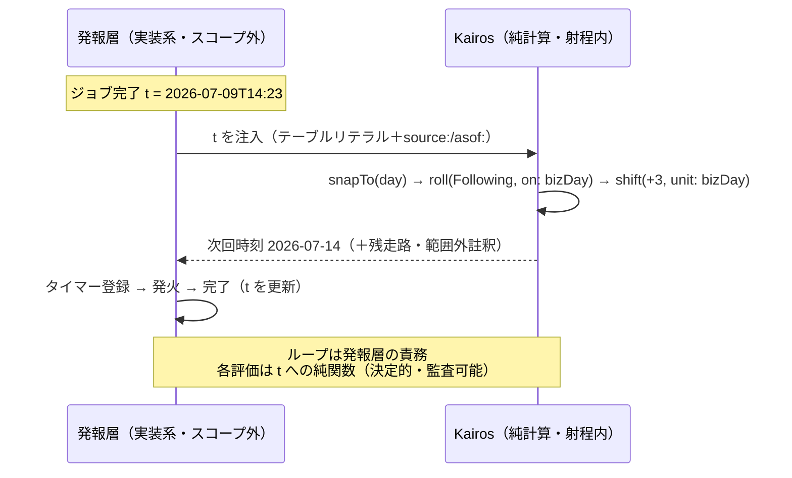
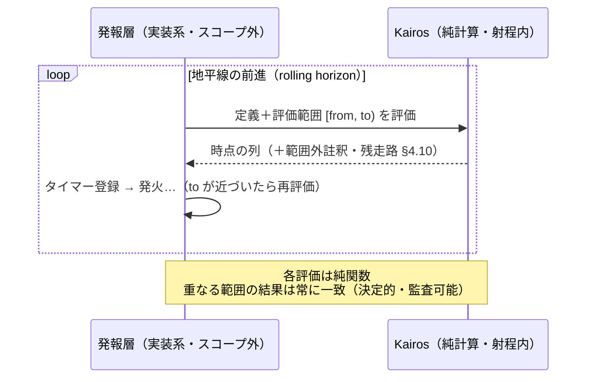

# Kairos 言語仕様 — 7. 代表例

各例を糖衣（日常形）と core 展開の両方で示す。糖衣はすべて core に展開でき、意味論は core が担う（§4.8）。

## 7.1 毎月末の 3 営業日前

```text
# 糖衣
@JP
monthEnd |> roll(Preceding, on: bizDay) |> shift(-3, unit: bizDay)

# core 展開
@JP
everyDay |> within(month) |> last |> roll(Preceding, on: bizDay) |> shift(-3, unit: bizDay)
```

全日を月ごとに束ね、各月の最終日を採り、営業日でなければ前営業日へ寄せ、そこから 3 営業日戻す。`monthEnd` は
暦法純粋（I8）なので暦日の月末を出す。営業日への調整は後段の `roll` が担う。`on: bizDay` は `@JP` の
`calendar: TSE` からの**標準導出**（`everyDay \ TSE.nonWorking`。§3.9・ADR-35）に解決される。軸を後置に
畳めば `@JP axis: bizDay` の下で `on:`/`unit:` を省ける（§3.3。実体名の直指 `axis: TSE` も可）。

## 7.2 毎月第 2 営業日の次の金曜

```text
# 糖衣
@JP
everyDay |> businessDays(on: bizDay) |> within(month) |> nth(2) |> nextWeekday(Fri)

# core 展開
@JP
everyDay |> filter(on: bizDay) |> within(month) |> nth(2)
         |> roll(Following, on: (everyDay |> filter(x => weekday(x) == Fri)))
```

全日から営業日だけ残し、月ごとに束ね、各月窓の第 2 を採り、次の金曜へ進める。`nextWeekday(Fri)` の展開先は
**前方 roll**（金曜ラベル日の列を軸に寄せる。§4.8）で、週窓を経由しないため **WKST 非依存**。第 2 営業日が
金曜ならその日のまま（有効点は動かない）。`businessDays(on: p) = filter(on: p)` は最小の糖衣——**変換**（段）で
あり、生成子位置には置けない（機械的差し込み §4.8 で core 形が出なくなる。カレンダー依存の生成子は ADR-20 の
却下案でもある。F45）。

## 7.3 会計暦の定義（4 月始まり）

```text
# 糖衣（日常形）
premise Fiscal = Gregorian |> shiftBoundary(+3, on: year, unit: month)

# core 展開（with 上書き）
premise Fiscal = Gregorian with {
  year = month span (_ => 12) phase: 3 label: (p => yearNo(p))   # label: は上書きに継承されない＝同時付与（F96）
}
```

`Gregorian` の `year` を「暦月を 4 月始まりで 12 ずつ束ねる」に組み替えるだけ。`month` に触れないので暦日・月末は
不動（§3.7）。`quarter` は継承定義（`year split by month`）が新しい `year` に自動追従し、会計四半期（Apr-Jun/…）に
なる。`shiftBoundary` は `span` の位相ずらし一発に展開される（`k=12`・`φ₀=0`・`δ=+3`）。

会計暦は元と同じ資格で使える。本体式の前文で `calendar-system: Fiscal` を敷けば、以降の `within(year)` は会計
年度で束ねる。

```text
premise FY { calendar-system: Fiscal; calendar: TSE; tz: "Asia/Tokyo"; wkst: Mon }
@FY
everyDay |> within(year) |> first          # 各会計年度の初日（4 月 1 日群）
```

## 7.4 給料日（毎月 25 日・休日なら前営業日）

```text
@JP
everyDay |> within(month) |> nth(25) |> roll(Preceding, on: bizDay)
```

各月窓の第 25 日を採り、営業日でなければ前営業日へ寄せる。7.1 と同型の頻出パターン。

## 7.5 祝日カスケード（振替休日・国民の休日）

```text
@JP
nonHoliday  = everyDay \ statutory                    # statutory＝祝日の和（固定日・第 N 月曜・官報告示…）
substitutes = statutory |> filter(d => weekday(d) == Sun) |> roll(Following, on: nonHoliday)
sandwiched  = ((statutory |> shift(+1, unit: day)) & (statutory |> shift(-1, unit: day))) \ statutory
holidays    = statutory | substitutes | sandwiched    # カスケード（和・後勝ち）
```

振替休日＝日曜の祝日を「祝日でない日」軸で前方 roll（連休は自動で飛び越える）。国民の休日＝「祝日の翌日」と
「祝日の前日」の**積**から祝日を差し引く。移動は和で足す（元の日曜も残る）——優先度付き上書きの分解
（§4.5）がそのまま法文の構造に対応する。網羅的な検証は `../design/40-examples/01-jp-holidays.md`。

## 7.6 年の十二支（干支）

```text
premise JPEto = Gregorian with {
  yearBranch = year cycle [子, 丑, 寅, 卯, 辰, 巳, 午, 未, 申, 酉, 戌, 亥] anchor: 2020-01-01  # 2020=子
}
@JPEto
everyDay |> within(year) |> first |> filter(d => yearBranch(d) == 午)   # 午年の元日（2026, 2038, …）
```

`cycle` は周期長・適用先とも任意（§3.6）。`anchor:` の属する年窓が先頭ラベル（子）になり、ラベルは値式の
述語（`yearBranch(d) == 午`）で読む。日の十干十二支・六曜などの検証は `../design/40-examples/02-cycles.md`。

## 7.7 注入された時点からの次回計算——「前回完了から N 営業日後」の正しい書き方

cron 系からの移行で最初に突き当たる問い——「前回完了から 3 営業日後、のような**実行起点相対**は
書けるのか」。答えは二段になる。

- **書けない（意図的なスコープ外・§1）**: 「前回完了から 5 時間ごと、完了のたびにリセット」を
  **単一の無限ストリーム**として書くこと。式の出力（実行結果）が入力に戻るフィードバックで、
  純粋性（I7）と外延性（式＝時点の集合）が壊れる。
- **書ける（最初から射程内）**: **与えられた** 1 点 t からの「次の発火時刻」。t が固定なら決定的な
  暦計算＝純関数で、必要な器はすべて既存——「ある時点」は**単一要素のテーブルリテラル**（§3.8）、
  営業日算術は `roll`＋`shift`（§4.4）:

```text
@JP
lastCompleted = [2026-07-09T14:23] covering: ..     # 発報層が注入する「前回完了」（source:/asof: つき）
lastCompleted |> snapTo(day) |> roll(Following, on: bizDay) |> shift(+3, unit: bizDay)
#=> 2026-07-14
```

「前回完了」は祝日データと同格の**外部データ**として注入する（ADR-15 のデータ供給の切り離し）。
再評価のループ——完了のたびに t を差し替える——は発報層（実装系）の責務で、言語との分業は
次の形に閉じる:



要点:

- **各評価は純関数**——同じ t からは常に同じ次回時刻が出る（再起動・リプレイ・監査で安全）。
- **註釈も付いてくる**——`bizDay` 依存なので、祝日データが尽きた先の次回計算には範囲外註釈と
  残走路が並走する（§4.10。発報層の「データ更新が要る」運用信号になる）。
- **整列の統治が誤形を止める**——時刻付きの t をそのまま `bizDay` 軸に流すと静的エラー
  （§4.5）。`snapTo(day)` で明示に日粒度へ落とすのが正準。経過形（「5 時間後」）は
  `shift(+5, unit: hour)` でそのまま。
- 実行検証（doctest 4 例）と誤形の実測は `../design/40-examples/07-injected-origin.md`。
  発報層側の実装検討は適用先の実装プロジェクト（非公開）で実施。

## 7.8 発報層との分業（一般形）——時間ストリームの消費ループ

§7.7 は「注入された 1 点からの次回計算」という特殊形だった。**任意の** Kairos 定義（時間ストリーム）を
実装系（発報層）が消費する一般形も、分業は同じ原理で閉じる——**言語は評価範囲に対する時点の集合
（外延）を返すだけ**（§1.4）で、タイマー登録・発火・再評価のループはすべて発報層の責務。



要点:

- **決定性**——同じ定義・同じ評価範囲・同じデータ（asof）からは常に同じ列が出る。地平線を進めて
  再評価しても、**重なった区間の時点は一致する**（評価範囲は「どこを見るか」であって「どこから
  数えるか」ではない——起点は式の側が `from:` 等で持つ。ADR-31 の帰結）。発報層は安心して評価を
  重ねられる。
- **missed-fire の列挙**——停止していた期間 [down, up) をそのまま評価範囲として渡せば、その間に
  発火すべきだった時点が**列として**返る（cron の scanOnBoot 級の機能が、言語側は何も足さずに
  済む——定義＝時点の集合、の外延性の帰結）。
- **運用信号**——祝日データ等が尽きた先の時点には範囲外註釈と残走路が並走する（§4.10）。発報層は
  これを「データ更新が要る」の機械可読な信号として消費できる。
- 「前回完了から」のような実行起点相対は、t を外部データとして注入する特殊形に分解する（§7.7）。
- 三性質（決定性・missed-fire・運用信号）は実装系への適用検討（非公開）で実測済み——重なり区間の
  完全一致・停止期間の未発火列挙・データ切れ註釈の運用信号化を確認。
